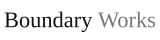
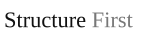
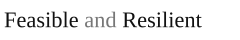
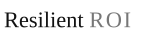
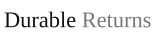
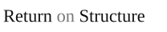

There is a company to be named. Its only product is operating method + advice: how a business applies the [DBJ Method](https://method.dbj.org/shop/). Not delivery, not staffing, not a platform. Advice on structure, sold to organizations that already feel the weight of the AI Hype upon them.

The name has to survive being said out loud to a CEO who is late, sceptical, and has heard "transformation" too many times.

## Constraints

- **No buzzword.** Nothing containing *agile*, *digital*, *synergy*, *nexus*, *forge*, or *labs*.
- **Short.** One word if possible, three at most.
- **Load-bearing, not decorative.** The name should mean something structural, because that is what is being sold.

## Candidates

| ID | Title | TM | Direction | Means | Comment |
|---|---|---|---|---|---|
| 1 | **Boundary Works** |  | Plain English | Boundaries are what the method sells | No metaphor, no explanation needed. Slightly flat. |
| 2 | **Structure First** |  | Plain English | The mandate as a name | Clear to the point of being a slogan, and slogans age badly. |
| 3 | **Artificial But Capable** |  | AI-facing | ABC — yes it is artificial, and it still does the job | Concedes the sceptic's point and walks past it. Free acronym, memorable, spellable over the phone. **Survives.** |
| 4 | **Artificial Feasible and Resilient Operation** |  | AI-facing | AFRO | *Artificial Feasible* does not parse; the adjectives have no noun until the very end. And the acronym is the only part anyone retains, which makes the name about a hairstyle. |
| 5 | **Feasible and Resilient** |  | AI-facing | Two qualities | Two adjectives, no noun — a promise rather than an entity. Sounds like a law firm missing its other half. *Feasible* is the weakest word on the table: it means *can be done*. |
| 6 | **Resilient ROI** |  | Outcome | Returns that hold up | Names the result instead of the method, in the site's own vocabulary (EA AI ROI). ROI is the one term that survives contact with an executive who is not listening. Mildly consultant-ish. **Survives.** |
| 7 | **Durable Returns** |  | Outcome | The same claim without the acronym | *Durable* already lives in this vocabulary. Reads as a fund name, which is either an asset or a problem. |
| 8 | **Return on Structure** |  | Outcome | ROS — the return comes from the structure, not the features | States the thesis as a financial metric. The one name here that argues rather than asserts. |
| 9 | **ROI Discipline** |  | Outcome | The outcome and the temperament required to get it | Cold, no hype, slightly severe. Closest in tone to how the method actually behaves. |
| 10 | **Resilient Outcomes** | &nbsp; | Outcome | The results hold after the engagement ends | *Outcomes* is the word buyers already use for what they are paying for, so the name is legible on first hearing. But it sits in the crowded middle of the consulting namespace — could be healthcare analytics, could be change management. Says nothing about AI or structure. |
| 11 | **Feasible Outcomes** | &nbsp; | Outcome | It can be done, and it will land | *Feasible* is the lowest bar in the language — nobody hires a firm for what is merely possible. Weakest name on the table. |

## Current choice

1.  ARTIFICIAL BUT CAPABLE Ltd (3) 
2.  Resilient ROI Ltd (6).

They are two different companies. ABC names an AI advisory that is structural underneath. Resilient ROI names an outcome shop that does not care what you call the method.

## Open

This post is a working note, not a decision. The next round decides which of the two firms is actually being founded.
