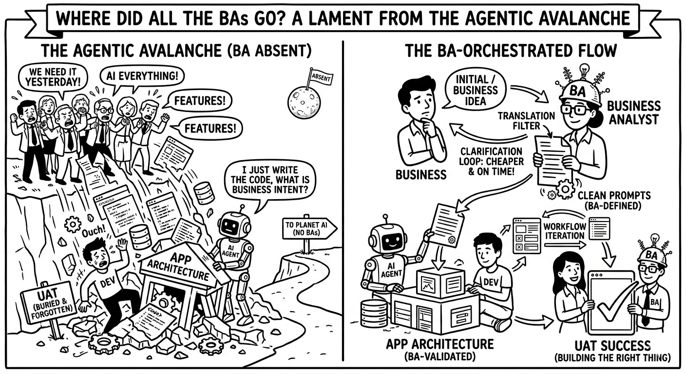

# Agentic avalanche has buried the BA role


This is written for organization where LLM and Agent are already in use.


Perhaps a very real and dangerous friction point in the current evolution of software development.

If it appears that Business Analysts (BAs) are absent from the world of AI, Large Language Models, and autonomous agents, it is not because they are obsolete. Rather, it is because the current hype cycle "Agentic Avalanche," has temporarily blinded many to the distinction between **building the thing right** and **building the right thing**.

Here is a perspective from inside that avalanche on why the BA function is actually becoming *more* critical, not less, as AI changes the development landscape.

## 1. The Translator in the Age of High-Speed Coding

The link and the buffer.

#### Business (Intent) ↔ **BA (Translation)** ↔ DEV (Implementation)

AI agents are fast (assuming the precise prompts). However, AI agents possess zero business context (do not confuse with agentic context). They do not understand market nuances, stakeholder market politics, regulatory compliance, or long-term strategic goals.

If the "Business" prompts an Agent directly, the result is almost always a very fast implementation of a misunderstood requirement. That is the CTO, AI and a free weekend syndrome.

### The BA in the AI Era

The BA’s job moves from manual documentation to **Prompt Engineering for Business Intent**. The BA does take raw business stakeholder inputs and refine them into high-fidelity "prompts" (whether that's a Product Requirements Document  (PRD), a user story, or functional specs) that are sufficiently precise for an AI agent (or a human dev) to execute without ambiguity.

Of course in real life situations BAs prompt will exist as Context. Or a major part of a Context. Otherwise BA will write the doc send it to DEVs and they will reformat it into the Context. Not efficient.

> In DBJ.Method terms that is the `P <--> T` Cycle. In the `B <- Cycle 1 -> P <- Cycle 2 -> T` loop.

## 2. The decoupled Loop that is Cheaper, and Faster

Rectifying requirements in the **Business ↔ BA** loop, without devs, is cheaper and on time. That is almost 100% correct.

> In DBJ.Method terms that is the `B <--> P` Cycle.

The risk today is that because AI makes *coding* feel cheap and fast, whole organisations are skipping this initial loop, defining phase and moving straight to implementation. They assume, "If the agent gets it wrong, we’ll just have it recode it."

This is a fallacy of false economy. Every iteration of code, even AI code, introduces complexity, potential technical debt, and integration risks.

The BA role is to conduct **conceptual prototyping** before a single line of production code is thought about. Whether using a whiteboard, Figma, or an AI wireframe tool, the BA validates the user flow and business logic with stakeholders *first*. Fixing a workflow in a wireframe takes minutes; fixing it in an AI-generated codebase, after deployment pipelines are set up, still takes days and invites regression bugs.

## 3. The Re-emergence of UAT

User Acceptance Testing (UAT) are being buried under the "Agentic Avalanche".

There is a growing, dangerous assumption that if an AI generated the code, and an AI tested the code, the code must be correct. This confuses Functional Testing (did the code run?) with Acceptance Testing (does this solve the user’s problem?).

As developers increasingly rely on AI to sort out the App Architecture and generate implementation details, the responsibility for **final verification** shifts heavier onto the BA and the Business stakeholders.

If an AI agent builds a feature based on a requirement, a humans (the BA and the Business) must still perform UAT to ask:

* *Did we ask for the right thing?*
* *Does this solution actually make the user's life better?*
* *Does the edge case handling match business policy, not just default code logic?*

## Summary: new BA role

Make sure the BA in your organization is not absent; the BA is being upgraded.

Instead of writing endless Jira tickets manually, make the BA of the immediate future the **Orchestrator** of the development lifecycle. They stand between the Business Stakeholders and the Agentic/Human Dev pool, ensuring that velocity does not outpace direction.

Without the BA, we are just building things we don't need, faster than ever before.

