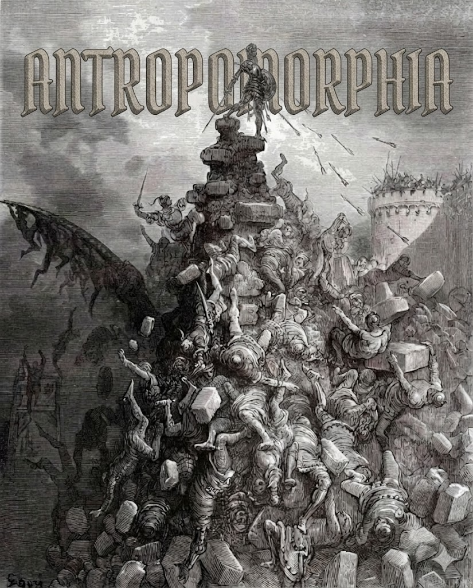

# Do not succumb to anthropomorphized "AI" terminology

Preserve the organization's sanity in presence of relentless AI hype. **AI Antropomorphia never sleeps**.


I found this piece by Emily Bender and Nanna Inie regarding the pervasive issue of anthropomorphizing "AI" terminology. Given DBJ Method focus on deterministic, data-driven systems, I thought this was worth remembering, and perhaps using for sane every day communication.

They argue the current industry jargon masks the reality of the tools, and they propose a more precise, functional vocabulary to keep engineering and policy discussions grounded.


## Counter the AI Anthropomorphia with your own terminology

Good for sober product management and business navigating in the age of AI Readiness.

**Key shifts they proposed, and we adopted**


Of course not word for word. We are proposing defense by vocabulary, before starting on the next project.


| Instead of Anthropomorphic | Use your own words suitable |
|---|---|
| **"AI" / "Artificial Intelligence"** | **Probabilistic automation** · **Statistical pattern matcher** · **Machine learning system** |
| **"Chatbot" / "Agent"** | **Conversation simulator** · **Probabilistic, unverified software manipulator** · **Text-completion service** |
| **"Hallucination"** | **Undesirable output** · **Fabricated output** · **Statistically plausible error** |
| **"Neural Networks"** | **Weighted networks** · **Parameterized statistical model** · **Matrix multiplication pipeline** |
| **"Prompting"** | **Text input** · **Query construction** · **Parameter specification** |

Core argument is that we must stop assigning agency to software. Agency resides with the people who build and use the systems; the software itself is merely a tool performing calculations.

It is a useful exercise to strip away the "AI" Anthropomorphic layer and describe what the system is actually doing. 

Please make sure to read the original article: [https://buttondown.com/maiht3k/archive/how-to-talk-about-ai-without-adding-to-the/](https://buttondown.com/maiht3k/archive/how-to-talk-about-ai-without-adding-to-the/)

---

**That is Army of Antropomorphia attacking your Fortress of AI Sanity**

A 19th-century-style engraving (Gustave Doré aesthetic) depicting a chaotic siege or storming of a fortress — a frenzied mob of armed figures clambering over each other, swords and weapons raised, scaling toward a tower under a dark, lightning-streaked sky. 

It's a visual metaphor for the article's argument — anthropomorphizing AI language is a chaotic, mob-driven assault (marketing hype, loose terminology) storming the fortress of precise, technical thinking. The violence and disorder of the image stand in for the "AI Marketing Avalanche" we do warn against.

