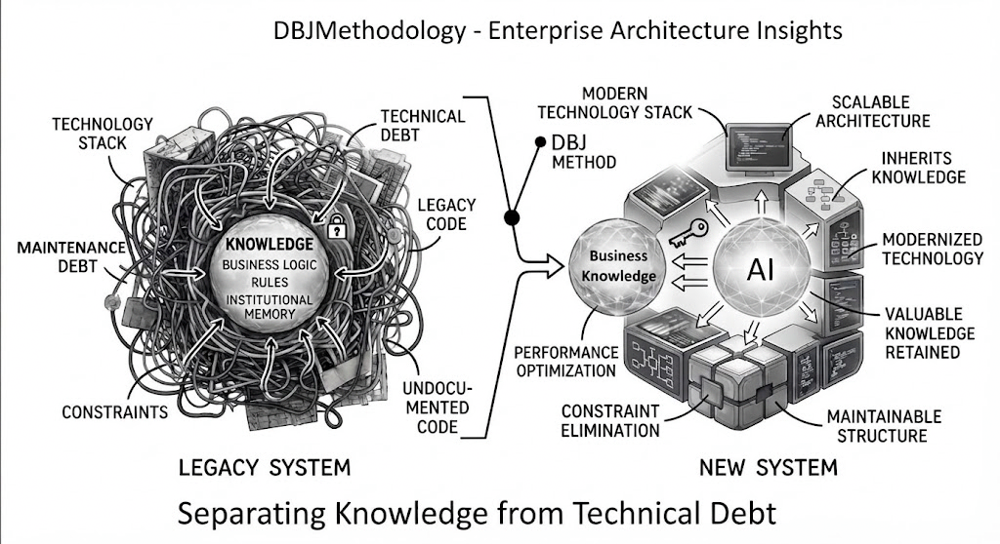
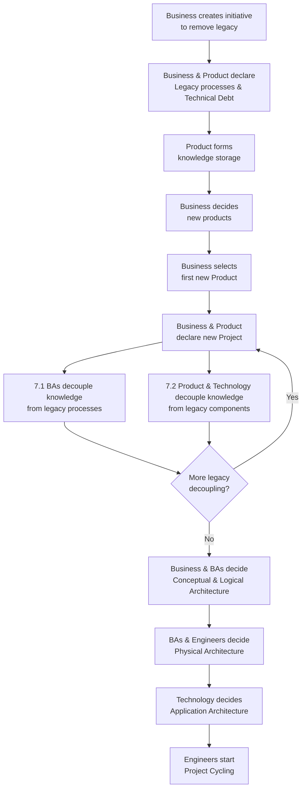

<!-- # Break that Iceberg and free your true value -->

## Knowledge Liberation

### Technical Debt is Business Value imprisoned in the Iceberg of Legacy Technology.

> Break that Iceberg and free your true value.

**Refactoring is very wide circle of pain, back to the beginning.**

### BPT Domains are gravitational regions of gravitational pull for organization roles, circling around them.

* Business roles to the Business Domain
* BA roles  around the Products Domain
* Engineers and DevOps around the Technology Domain

## How is Knowledge Liberated

**Order of events**

1. Business creates the initiative to remove the legacy technologies
2. Business & Product declare Legacy processes and Technical Debt products, data , infrastructure etc.
3. Product forms knowledge storage (inside Products domain) where knowledge decoupled from Technical Debt will be stored and classified
4. Business decides on the new products, to be born from the initiative
5. **Business decides on the first new Product to be created to replace Legacy Product and Processes**
6. Business & Product declare and new Project 
7. For the chosen product 
   1. BAs identifies legacy processes and start decoupling knowledge from legacy business processes
   2. Product  &  Technology identify the legacy components and start decoupling knowledge from legacy technologies.
8. If there are more legacy decoupling to be done, loop to 7.
9.  Business & BAs from Products decide on the conceptual and logical architecture of the new product
10. BA's and Engineers (from Technology Domain) decide on the Physical Architecture of the new Product
11. Technology decides on the Application Architecture of the new Product
12. Engineers start new Product Project Cycling

**The Workflow**

