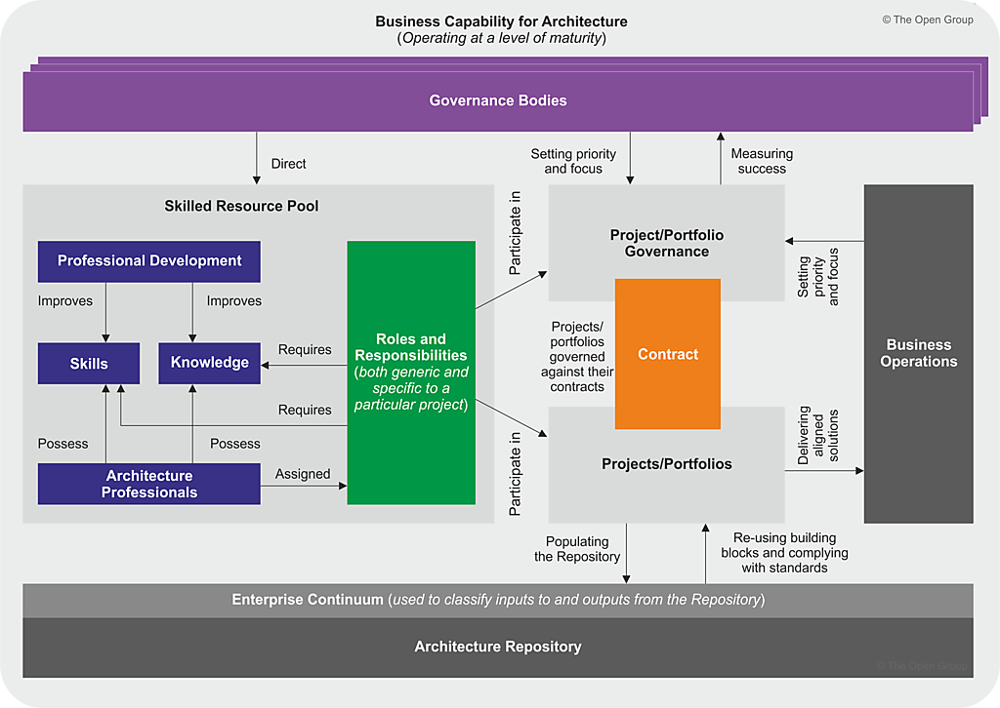

# Exploring the Architecture Capability Framework in TOGAF: Components and Benefits

Architecture plays a critical role in the success of an organization. It enables organizations to align their business strategies with technology solutions, thereby improving their efficiency and reducing risks. However, establishing and maintaining an effective architecture practice can be a daunting task. That's where the Architecture Capability Framework comes in.

Developed by The Open Group Architecture Forum (TOGAF), the framework provides a comprehensive set of guidelines for organizations to establish and maintain a robust architecture practice. The framework consists of seven components, including Architecture Capability, Architecture Board, Architecture Compliance, Architecture Contracts, Architecture Governance, Architecture Maturity Models, and Architecture Skills Framework. In this article, we will delve into each of these components and understand their role in establishing an effective architecture practice.

## The Architecture Capability Framework for TOGAF

TOGAF (The Open Group Architecture Framework) is a widely used framework for enterprise architecture. One of the key components of TOGAF is the Architecture Capability Framework, which helps organizations establish and maintain an effective architecture practice.

The Architecture Capability Framework consists of several components that work together to enable the organization to create and manage its architecture assets. These components include:

1. **Establishing an Architecture Capability:** This involves setting up the necessary structures, processes, and roles to support the organization's architecture practice. This includes defining the scope of the architecture practice, identifying stakeholders and their roles, and establishing the necessary governance mechanisms.
2. **Architecture Board:** The Architecture Board is responsible for overseeing the development and implementation of the organization's architecture. The board provides guidance and direction to the architecture team, ensures alignment with business strategy and goals, and helps to resolve any conflicts that arise.
3. **Architecture Compliance:** This component ensures that the organization's architecture complies with relevant standards, policies, and regulations. This includes establishing a compliance framework, conducting compliance assessments, and addressing any compliance issues that arise.
4. **Architecture Contracts:** Architecture contracts are agreements between the architecture team and other stakeholders in the organization. These contracts define the scope, objectives, and deliverables of the architecture work, as well as the roles and responsibilities of the parties involved.
5. **Architecture Governance:** Architecture governance ensures that the organization's architecture is aligned with business strategy and goals, and that it supports the organization's overall performance. This includes establishing governance structures, defining governance processes, and monitoring the effectiveness of governance mechanisms.
6. **Architecture Maturity Models:** Architecture maturity models help organizations assess the maturity of their architecture practice and identify areas for improvement. These models provide a framework for evaluating the organization's architecture capabilities and determining the appropriate level of investment in architecture.
7. **Architecture Skills Framework:** The Architecture Skills Framework helps organizations identify the skills and competencies required for effective architecture practice. This includes defining architecture roles and responsibilities, identifying required skills and knowledge, and developing training and development programs to build architecture skills.

## Establishing an Architecture Capability

Establishing an Architecture Capability involves using the ADM to establish a framework for the organization's architecture practice. This process requires the design of the four domain architectures: Business, Data, Application, and Technology. To establish the architecture practice, the following architectures must be designed:

- The Business Architecture of the architecture practice, which highlights the Architecture Governance, architecture processes, architecture organizational structure, architecture information requirements, architecture products, and more.
- The Data Architecture, which defines the structure of the organization's Enterprise Continuum and Architecture Repository.
- The Application Architecture, which specifies the functionality and/or application services required to enable the architecture practice.
- The Technology Architecture, which depicts the architecture practice's infrastructure requirements and deployment in support of the architecture applications and Enterprise Continuum.

By designing these architectures, the organization can establish an effective architecture practice that aligns with business goals and enables the creation and management of architecture assets.

## Architecture Board

Another component of the Architecture Capability Framework is the Architecture Board, which provides guidelines for establishing and operating an Enterprise Architecture Board. The Architecture Board is responsible for overseeing the development and implementation of the organization's architecture, ensuring alignment with business goals, and resolving any conflicts that arise. The Architecture Board helps to ensure that the architecture practice is effective and efficient by providing guidance and direction to the architecture team. By implementing the Architecture Board component of the Architecture Capability Framework, organizations can establish a governance structure that enables effective decision-making and promotes the success of the architecture practice.

Here's an example of how to set up an Architecture Board:

1. **Define the purpose and scope of the Architecture Board:** The first step in setting up an Architecture Board is to define its purpose and scope. This involves determining what the board will be responsible for, what its goals are, and how it will interact with other stakeholders in the organization. For example, the Architecture Board may be responsible for overseeing the development and implementation of the organization's architecture, ensuring alignment with business goals, and resolving any conflicts that arise.
2. **Determine the membership of the Architecture Board:** The next step is to determine who will be on the Architecture Board. This involves identifying stakeholders from across the organization who have the necessary expertise and authority to make decisions related to the organization's architecture. For example, the Architecture Board may include representatives from IT, business, and other relevant areas of the organization.
3. **Establish the governance structure of the Architecture Board:** Once the membership of the Architecture Board has been determined, the next step is to establish the governance structure of the board. This involves defining the board's operating procedures, decision-making processes, and communication channels. For example, the Architecture Board may meet monthly to review proposed architecture changes and make decisions about which changes to implement.
4. **Develop a charter for the Architecture Board:** A charter is a document that outlines the purpose, scope, membership, and governance structure of the Architecture Board. The charter should be reviewed and approved by all board members and other relevant stakeholders. The charter should also be regularly reviewed and updated as needed.
5. **Implement the Architecture Board:** Finally, the Architecture Board should be implemented and begin its work. This involves communicating the purpose and scope of the board to relevant stakeholders, holding regular meetings, and making decisions related to the organization's architecture.

By following these steps, organizations can establish an effective Architecture Board that enables effective decision-making and promotes the success of the architecture practice.

**Example:**

here's a real-life example of an organization that established an Architecture Board to address a problem:

**Problem Description:** A large financial institution was experiencing significant challenges with its IT systems. The organization had grown rapidly through a series of mergers and acquisitions, resulting in a complex IT landscape with numerous legacy systems and redundancies. The organization was struggling to maintain its systems, and its IT staff were stretched thin trying to keep up with demand.

**Solution:** To address these challenges, the organization decided to establish an Architecture Board. The purpose of the board was to oversee the development and implementation of the organization's architecture, ensure alignment with business goals, and resolve any conflicts that arose.

The membership of the Architecture Board included representatives from IT, business, and other relevant areas of the organization. The board met monthly to review proposed architecture changes and make decisions about which changes to implement. The governance structure of the board was defined in a charter that outlined the purpose, scope, membership, and operating procedures of the board.

The Architecture Board quickly identified several areas of the organization's IT landscape that required attention. They developed a roadmap for modernizing the organization's systems, which included retiring legacy systems, consolidating redundant systems, and implementing new systems to meet the organization's evolving needs.

By implementing the Architecture Board, the organization was able to improve the effectiveness and efficiency of its IT systems. The board provided guidance and direction to the IT staff, ensuring that their work was aligned with business goals and priorities. The Architecture Board also helped to resolve conflicts that arose between different areas of the organization, promoting collaboration and cooperation. Overall, the Architecture Board played a critical role in helping the organization to address its IT challenges and position itself for future success.

## Architecture Compliance

Architecture Compliance is an essential component of the TOGAF Architecture Capability Framework that provides guidance on how to ensure that the organization's architecture adheres to relevant standards, policies, and regulations.

Establishing a compliance framework is the first step in ensuring architecture compliance. This involves defining the organization's compliance requirements and developing processes for monitoring and reporting compliance. For example, the compliance framework may include procedures for reviewing architecture changes and conducting compliance assessments.

The next step is conducting compliance assessments to determine whether the organization's architecture complies with relevant standards, policies, and regulations. This may involve reviewing documentation, interviewing stakeholders, and conducting tests or audits. The results of compliance assessments are used to identify areas of non-compliance and develop plans to address any issues that arise.

Finally, addressing compliance issues involves implementing corrective actions to bring the architecture into compliance. This may involve updating documentation, modifying processes, or making changes to the architecture itself. Regular monitoring and reporting of compliance is also important to ensure ongoing compliance.

By following the Architecture Compliance, organizations can ensure that their architecture is compliant with relevant standards, policies, and regulations. This can help to reduce risks and ensure that the organization's architecture is effective and efficient in supporting business goals and objectives.

**Example:**

**Problem Description:** A large healthcare organization has implemented a new electronic medical records (EMR) system. As part of the implementation, the organization must ensure that the EMR system complies with relevant regulatory requirements, such as HIPAA (Health Insurance Portability and Accountability Act), which sets standards for the privacy and security of patient health information.

To ensure compliance with HIPAA, the organization establishes an Architecture Compliance framework that includes regular compliance assessments and reporting. The organization also conducts a detailed review of the EMR system to identify any potential compliance issues.

During the compliance review, the organization identifies several areas where the EMR system does not fully comply with HIPAA requirements, such as inadequate access controls and insufficient logging and auditing of user activity. The organization develops a plan to address these issues and implements corrective actions to bring the EMR system into compliance with HIPAA.

To ensure ongoing compliance, the organization establishes processes for monitoring and reporting on compliance, including regular audits and reporting to senior management. These processes help the organization to identify and address compliance issues in a timely manner and ensure that the EMR system remains compliant with relevant regulations.

By implementing an Architecture Compliance framework, the healthcare organization was able to ensure that its EMR system complied with HIPAA requirements, reducing the risk of security breaches and protecting patient health information. The organization also demonstrated its commitment to compliance, which can help to build trust with patients, regulators, and other stakeholders.

## Architecture Governance

Architecture governance is a critical component of the TOGAF Architecture Capability Framework, as it ensures that the organization's architecture is aligned with its overall business strategy and goals. The process of architecture governance involves establishing governance structures, defining governance processes, and monitoring the effectiveness of governance mechanisms.

Governance structures are the foundation of architecture governance, and they provide the framework for decision-making and oversight. These structures include the Architecture Board, which is responsible for overseeing the development and implementation of the architecture artifacts, as well as other governance bodies, such as steering committees and working groups. The Architecture Board is composed of senior executives and stakeholders from various business units and functions, and it ensures that the architecture is aligned with the organization's overall business strategy and goals.

Defining governance processes is another critical aspect of architecture governance, as it ensures that the necessary steps are taken to develop and implement the architecture artifacts. Governance processes include the review and approval process for architecture artifacts, as well as the communication and collaboration process between stakeholders. These processes ensure that all relevant stakeholders are involved in the development and implementation of the architecture artifacts, and that their feedback is incorporated into the final design.

Finally, monitoring the effectiveness of governance mechanisms is an ongoing process that ensures that the governance framework is working effectively. This includes the use of metrics and performance indicators to monitor the progress of the architecture artifacts and to identify areas where improvements can be made. By monitoring the effectiveness of governance mechanisms, organizations can ensure that their architecture is aligned with their overall business strategy and goals, and that it supports their overall performance.

**Example**: A multinational retail company is looking to expand its operations into new markets and increase its online presence. To achieve these goals, the company decides to embark on a digital transformation initiative that includes developing a new e-commerce platform, integrating its supply chain management system, and optimizing its distribution network.

To ensure that the digital transformation initiative is aligned with the company's business strategy and goals, an architecture governance framework is established. The framework includes:

- governance structure,
- governance board,
- governance processes, and
- governance mechanisms.

1. The **governance structure** includes an Architecture Board, which is responsible for overseeing the development and implementation of the architecture artifacts and ensuring that they align with the company's business strategy and goals.
2. The **Architecture Board** is composed of senior executives from various business units and functions, including IT, finance, marketing, and operations.
3. The **governance processes** include a review and approval process for all architecture artifacts, such as architecture principles, standards, and models. The review and approval process involves the Architecture Board and other relevant stakeholders, and ensures that the artifacts are aligned with the company's business strategy and goals.
4. The **governance mechanisms** include metrics and performance indicators that are used to monitor the effectiveness of the architecture governance framework. For example, the company may track the percentage of architecture artifacts that are reviewed and approved within a certain timeframe, or the number of architecture-related issues that are resolved in a timely manner.

By establishing an architecture governance framework, the multinational retail company was able to ensure that its digital transformation initiative was aligned with its business strategy and goals. The governance framework provided a structured approach for developing and implementing the necessary architecture artifacts, and ensured that all relevant stakeholders were involved in the process. The governance mechanisms helped to monitor the effectiveness of the governance framework and identify areas for improvement, ensuring that the company's architecture supported its overall performance.

## Architecture Maturity Models

Architecture maturity models are a critical component of the TOGAF Architecture Capability Framework, as they provide organizations with a framework for assessing the maturity of their architecture practice and identifying areas for improvement. These models help organizations determine the appropriate level of investment in architecture and set goals for improving their architecture capabilities over time.

An architecture maturity model typically consists of several levels or stages, each representing a level of maturity in the organization's architecture practice. These stages typically include:

1. **Initial:** The organization has no formal architecture practice and does not use a consistent approach to architecture development.
2. **Ad Hoc:** The organization has some ad hoc architecture practices in place, but they are not consistently applied across the organization.
3. **Defined:** The organization has a defined architecture practice with established processes and guidelines, but they are not consistently applied across the organization.
4. **Managed:** The organization has a well-defined and consistently applied architecture practice, and performance is measured and managed.
5. **Optimized:** The organization's architecture practice is continuously improving, with a focus on innovation and driving business value.

By assessing the maturity of their architecture practice against these stages, organizations can identify areas for improvement and set goals for advancing their architecture capabilities. For example, an organization that is at the ad hoc stage may focus on establishing a more consistent approach to architecture development, while an organization that is at the managed stage may focus on measuring and improving the performance of its architecture practice.

Architecture maturity models provide organizations with a framework for assessing the maturity of their architecture practice and identifying areas for improvement. By using these models, organizations can set goals for advancing their architecture capabilities and ensure that their architecture practice is aligned with their overall business strategy and goals.

**Example**

A real-life example of an architecture maturity model is the Architecture Maturity Model developed by Carnegie Mellon University's Software Engineering Institute (SEI). This model is widely used by organizations to assess the maturity of their software architecture practices.

The SEI Architecture Maturity Model consists of five levels, similar to the ones I described above:

1. **Initial:** Architecture practices are ad hoc and not well-defined. There is no formal process for architecture development.
2. **Repeatable:** Architecture practices are partially documented and may vary across projects. There is some level of process definition, but it is not consistently applied.
3. **Defined:** Architecture practices are documented and consistently applied across projects. The organization has established architecture principles and guidelines.
4. **Managed:** Architecture practices are measured and managed, and performance metrics are used to improve architecture capabilities. Architecture practices are integrated into the organization's overall management processes.
5. **Optimizing:** Architecture practices are continuously improving, with a focus on innovation and driving business value. The organization has a culture of continuous improvement and is actively seeking new ways to improve its architecture practices.

Using this model, organizations can assess the maturity of their architecture practices and identify areas for improvement. For example, an organization that is at the repeatable level may focus on improving its process definition and documentation, while an organization that is at the defined level may focus on improving the consistency of architecture practices across projects. An organization that is at the managed level may focus on measuring and managing the performance of its architecture practice, while an organization that is at the optimizing level may focus on driving innovation and improving business value through its architecture practices.

## Architecture Skills Framework

The Architecture Skills Framework is essential for an organization to have a clear understanding of the required skills and competencies for effective architecture practice. This framework helps organizations identify the knowledge, skills, and abilities that architecture team members need to have to perform their roles effectively.

The Architecture Skills Framework includes defining architecture roles and responsibilities, identifying required skills and knowledge, and developing training and development programs to build architecture skills. This framework helps ensure that architecture team members have the necessary skills to support the organization's goals and objectives.

For example, the Architecture Skills Framework may identify the following roles within the architecture team:

- Enterprise Architect
- Solution Architect
- Data Architect
- Application Architect
- Technical Architect

Each of these roles requires specific skills and knowledge. The Architecture Skills Framework may identify the following skills and competencies required for each role:

- **Enterprise Architect**: Strategic thinking, business acumen, enterprise architecture frameworks, stakeholder management, communication skills
- **Solution Architect:** Solution design, technical knowledge, architecture frameworks, communication skills, problem-solving
- **Data Architect:** Data modeling, data governance, data management, database technologies, data analysis
- **Application Architect:** Application design, software engineering, programming languages, application frameworks, communication skills
- **Technical Architect:** Infrastructure design, technology trends, system administration, network design, security and compliance

Based on the identified skills and competencies, the organization can develop training and development programs to build architecture skills and ensure that architecture team members have the necessary skills to perform their roles effectively. This framework also helps identify skills gaps and areas for improvement in the organization's architecture practice.

**Example**

here's an example of how an organization might conduct a skills inventory using a table:

| Skill Area | Level of Expertise | Training Needs | Resources Needed |
|---|---|---|---|
| Enterprise Architecture Frameworks | Intermediate | Advanced training in TOGAF 9.2 | TOGAF 9.2 training course, online resources, mentorship |
| Data Modeling | Expert | N/A | N/A |
| Stakeholder Management | Intermediate | Advanced training in communication and negotiation skills | Communication and negotiation training course, mentorship |
| Solution Design | Beginner | Intermediate training in solution design best practices | Solution design training course, online resources, mentorship |
| Technical Knowledge | Advanced | N/A | N/A |

In this example, the organization has identified five skill areas relevant to its architecture practice and assessed the level of expertise for each. The organization has also identified training needs and resources needed to develop skills where expertise is lacking.

For example, the organization may have conducted an assessment of its architecture team members' skills and determined that there is a need for advanced training in TOGAF 9.2. The organization may then allocate resources to provide the necessary training through a TOGAF 9.2 training course and mentorship.

Similarly, the organization may have identified a skills gap in stakeholder management and determined that advanced training in communication and negotiation skills is needed. The organization can then allocate resources to provide the necessary training through a communication and negotiation training course and mentorship.

Overall, conducting a skills inventory using a table helps organizations identify skill gaps and develop training and development programs to build architecture skills and improve the effectiveness of the architecture practice.

## Summary

The Architecture Capability Framework is a comprehensive set of guidelines developed by The Open Group Architecture Forum (TOGAF) that helps organizations establish and maintain an effective architecture practice. The framework consists of seven components, including Architecture Capability, Architecture Board, Architecture Compliance, Architecture Contracts, Architecture Governance, Architecture Maturity Models, and Architecture Skills Framework.

Establishing an Architecture Capability provides guidelines on how to use the Architecture Development Method (ADM) to establish an architecture capability within an organization. Architecture Board provides guidelines for establishing and operating an Enterprise Architecture Board. Architecture Compliance ensures that the organization's architecture complies with relevant standards, policies, and regulations. Architecture Contracts are agreements between the architecture team and other stakeholders in the organization. Architecture Governance ensures that the organization's architecture is aligned with business strategy and goals, and that it supports the organization's overall performance. Architecture Maturity Models help organizations assess the maturity of their architecture practice and identify areas for improvement. Architecture Skills Framework helps organizations identify the skills and competencies required for effective architecture practice.

By following the Architecture Capability Framework, organizations can establish a robust and effective architecture practice that aligns with their business strategy and goals. This can result in improved efficiency, reduced risk, and increased business agility.

---

#### IP

> © 2026 by Visual Paradigm. All rights reserved. 
> 
> [Original source](https://guides.visual-paradigm.com/exploring-the-architecture-capability-framework-in-togaf-components-and-benefits/). 
>
> Unlike TOGAF content this page is publicly available.

