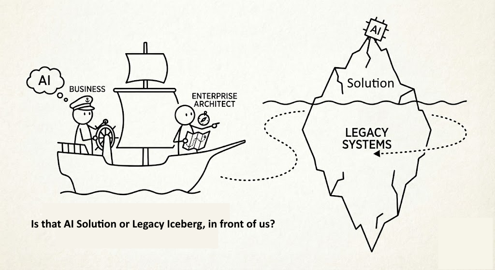

```
Clear roles == Clear communication == Safe Sailing
```



In the words of [Susanne Kaiser](https://www.linkedin.com/in/suksr/): *"if the underlying system does not evolve..."* — here are some risk examples:

- AI mirrors broken structures: in a big ball of mud with messy models and fuzzy boundaries, it propagates inconsistencies and hallucinates domain meaning
- AI amplifies organizational frictions: with repeated handoffs between teams, AI-accelerated code generation creates bigger queues at the handoff. It does not increase throughput, but inventory.
- AI builds the wrong things faster: without strategic guidance, it custom-builds commodities for non-differentiating problems that already have off-the-shelf alternatives.

For details: [Building Foundations for Continuous (AI-accelerated) Change](https://susannekaiser.net/building-foundations-for-continuous-ai-accelerated-change/)

## How DBJ.METHOD Addresses These Risks

Each of these risks has a structural root cause — and a structural remedy. The DBJ Method is designed to address them before AI enters the picture.

### Broken structures → Taxonomy first

AI mirrors what it finds. If the domain is undefined, AI will invent meaning. The DBJ Method begins with On-boarding — establishing a common Taxonomy as the organization's positioning system. Every Category, every Capability is named and fixed before any tool touches the codebase.

### Organizational friction → Maturity before velocity

AI-accelerated output without mature handoffs just builds bigger queues. The DBJ Method raises the organization to CMM Level L3 — defined processes, governance structures, and architecture-driven communication — before entering the delivery loop.

> Throughput improves because the path is clear, not because the ship engine is faster.

### Building the wrong things → EA as the governing layer

Without strategic guidance, AI will custom-build what should be bought off the shelf. In the DBJ Method, Enterprise Architecture is the meta-layer governing the BPT Loop — Business, Product, Technology in continuous cycle.

Under DBJ guidance, the client organization's EA decides *what* gets built and *why*. AI-assisted engineering accelerates the *how*, within those rails.
