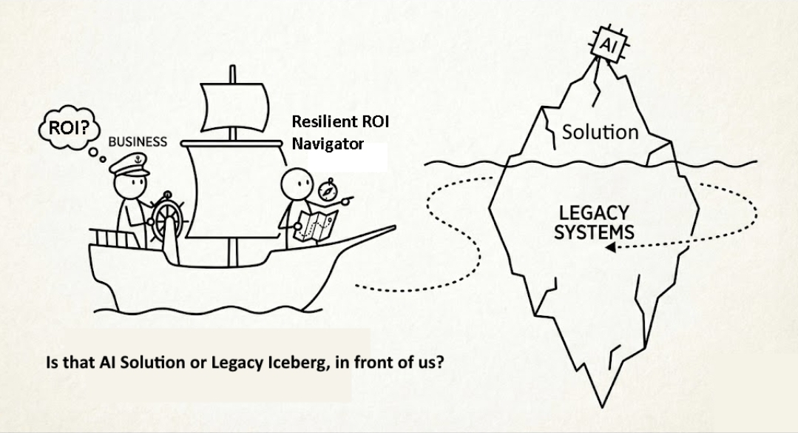

This simple image presents visually how large percentage of organizations think of and then approach AI adoption in enterprise environments:

* **The Illusion of the Quick Fix:** A ship labeled "Business" with a captain wondering about "ROI?" is heading toward an "debtberg" (aka iceberg of technical debt). Above the debtberg waterline sits a small, visible "Solution" topped with an "AI" chip—representing the superficial allure of plugging in a trendy probabilistic tool. Don't event mention phrases like "jumping onto the AI bandwagon".
* **The Submerged Threat:** Below the debtberg waterline lies the massive bulk of "LEGACY SYSTEMS," illustrating the futility of deploying AI without addressing underlying enterprise architecture, data foundations, and technical debt. A collision course waiting to happen.
* **The Need for Deterministic Navigation:** An "Resilient ROI Navigator," is charting a careful course with a map and compass. Extracting actual business value from AI requires deliberate, structured orchestration  (navigation) rather than blind momentum.

Without rigorous governance and architectural decoupling, organizations aren't modernizing; they're just crashing probabilistic AI demos into legacy problems.