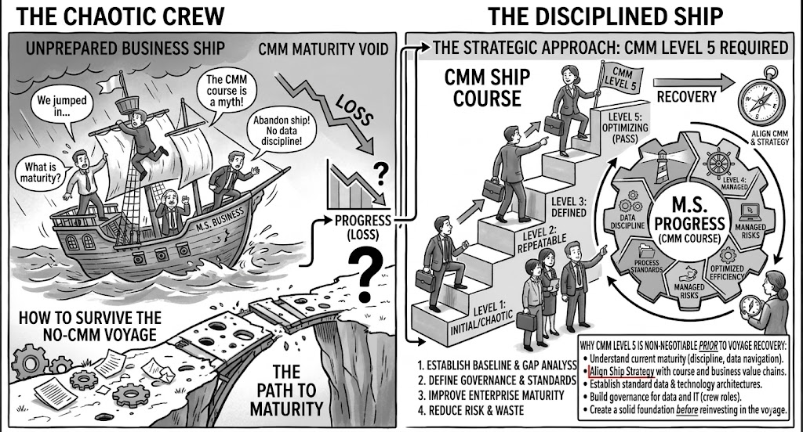

## The Flight Plan and the Autopilot

Most customers have never thought about an "operational model" as something they need to know about. BPT is new to them. So let's skip the taxonomy and use an analogy:

- **BPT Operational Loop = the Flight Plan.** The strategic path. How the organization spots an opportunity, builds something, and validates it. Not a software diagram.
- **WFL2026 / Temporal / Dapr = the Autopilot.** The machinery that keeps execution on course through turbulence — service crashes, timeouts, retries — without the pilot manually steering every adjustment.

The narrative that lands well with new customers:

1. **"We don't draw our code."** Business intent is too valuable to bury it in technical diagrams. BPT keeps business knowledge clean and independent of whatever implements it.
2. **"The technology is a black-box helper."** Dapr or Temporal isn't business process modeling. They are software shock absorbers, used so that when part of the system fails, it remembers where it was and recovers.
3. **"Separation of concerns is the goal."** Force business rules into a technical workflow engine, and you lose agility — you can't change the business without tearing down the technology.

## The Ship Analogy

The clearest version is an analogy, not a table:

**TOGAF is the sextant.** The Enterprise Architect is the navigator who reads it. The C-room steers the ship. **BPT is the set of behavioral rules in the operational manual** — how the whole crew is expected to run things, regardless of which instruments are belowdecks.

To be allowed on the bridge, crew pass the TOGAF CMM course, adjusted for the business, and the whole ship operates at CMM Level 5 — not just the navigator.

Below deck, in the **Technology engine room**, is where WFL2026 lives — the technical artifact service, the microservices and agents it coordinates, encrypted comms, stateful storage. None of it is visible from the bridge, and none of it should need to be.

## The takeaway

BPT is the operational manual. It doesn't live in a repo, and it doesn't get exported as BPMN XML. It's the operational manual the whole ship runs on.
