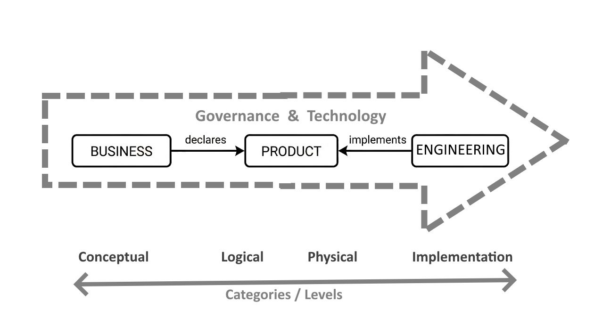
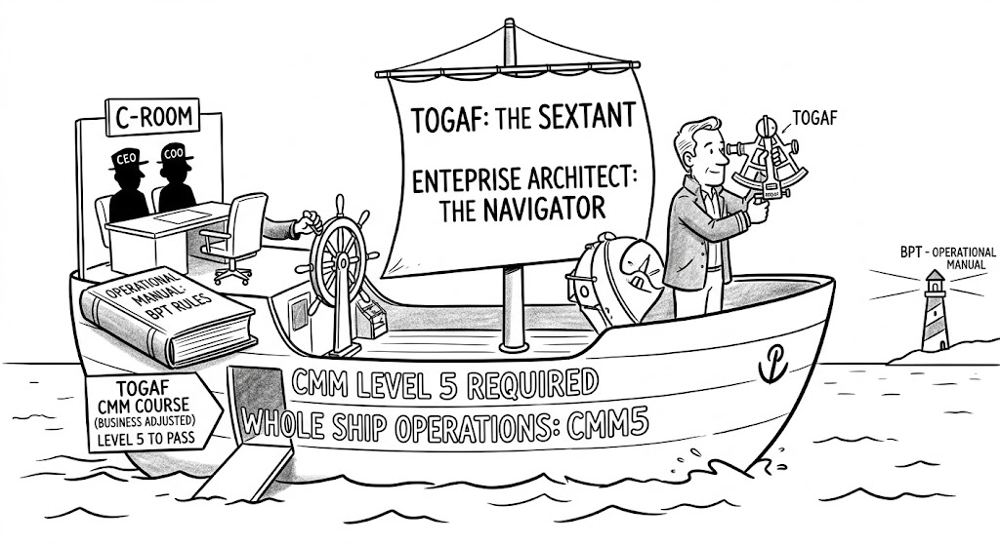

## Summary

"Workflow" is one word doing three jobs, and the collision is costing organizations clarity about what they actually own. Here's the untangling.

Just as we have different kinds of Architecture, we have different kind of Workflows. Again, [DBJ Taxonomy](https://method.dbj.org/taxonomy) brings order to the confusion. Feasibility to he struggle of intertwined responsibilities. And the required precondition of the functioning [BPT](https://method.dbj.org/bpt) (aka "the Loop"), of the [DBJ Method](https://method.dbj.org/index) Operating Model of the AI Readiness.

## Three things, one word

1. **WORKFLOW 20206 aka WFL2026 — the implementation artifact.** Epitomized in [Dapr](https://dapr.io/) and [Temporal](https://temporal.io/), and their relatives: code-first, durable orchestration for distributed systems. It is a promise of persistent state, survived crashes, managed retries. It exists because modern applications are shaping up as constellations of microservices and AI agents landing in production as containers; and someone has to keep track of where each one is "right now" in its execution. **WFL2026** lives entirely in the **Technology (T)** domain of the BPT op model. And it's optional — a product can be built without it.
2. **The analytical workflow — a Business Analyst's tool.** This is the diagram in [Cawemo](https://cawemo.com/) or a [BPMN](https://www.omg.org/spec/BPMN/) chart: **a description used to align stakeholders on a business process**. It belongs to the **Product (P)** domain, the domain of Business Analysts, who use it to detail and describe the business logic, in a form that will be consumed by the Technology (T) domain. **Business (B)** itself — the domain of business roles — doesn't need this tool. TOGAF's Business Architecture is one segment among eight; workflow is barely in it.
3. **[BPT](https://method.dbj.org/bpt) — the Operational Loop.** Not a workflow at all. BPT is the governance structure that deliberately decouples B from T, with P as the bridge. It's the "what" and "why" — the rhythm and viability of the organization — not a diagram and not code.

Calling all three "workflow" is the unfortunate terminology overflow. Once you separate them by the level of abstraction they cover, a lot of confusion dissolves on its own.

## Why the implementation artifact doesn't leak upward

WFL2026 sits in the T domain of the BPT. If a business rule changes at the BPT, Loop level, the logical flow in P may need updating — but the physical (application) workflow in T appears as a black box that executes whatever logic it's given. The BPT loop doesn't notice and shouldn't have to. WFL2026 consist of implementation artifacts on a lower levels of granularity.

This is the same principle as architecture generally: lower levels of abstraction don't redefine higher ones. (And a correction worth keeping precise — architecture isn't *a system*, deterministic or otherwise. Architecture is the **formal description** of a system and its parts.)

Treating WFL2026 as encapsulated in the (T) domain — something that turns the T's definitions into stateful, recoverable reality — keeps the boundary clean. The Operational Loop governs; the implementation artifact executes.

## Explaining it to customers who've never heard of any of this

Most customers have never thought about an "operational model" as something they need to know about. BPT is new to them. So lets skip the taxonomy and use the analogy:

- **BPT Operational Loop = the Flight Plan.** The strategic path. How the organization spots an opportunity, builds something, and validates it. Not a software diagram.
- **WFL2026 / Temporal / Dapr = the Autopilot.** The machinery that keeps execution on course through turbulence — service crashes, timeouts, retries — without the pilot manually steering every adjustment.

The narrative that lands well with new customers:

1. **"We don't draw our code."** Business intent is too valuable to bury it in technical diagrams. BPT keeps business knowledge clean and independent of whatever implements it.
2. **"The technology is a black-box helper."** Dapr or Temporal isn't business process modeling. They are Products cushions, used so that when part of the system fails, it remembers where it was and recovers.
3. **"Separation of concerns is the goal."** Force business rules into a technical workflow engine, and you lose agility — you can't change the business without tearing down the technology.

## The Ship Analogy

https://method.dbj.org/shop/

The clearest version is an analogy, not a table:

**TOGAF is the sextant.** The Enterprise Architect is the navigator who reads it. The C-room steers the ship. **BPT is the set of behavioral rules in the operational manual** — how the whole crew is expected to run things, regardless of which instruments are belowdecks.

To be allowed on the bridge, crew pass the TOGAF CMM course, adjusted for the business, and the whole ship operates at CMM Level 5 — not just the navigator.

Below deck, in the **Technology engine room**, is where WFL2026 lives — the technical artifact service, the microservices and agents it coordinates, encrypted comms, stateful storage. None of it is visible from the bridge, and none of it should need to be.

## The takeaway

When a customer's engineers say "we have a workflow for that," ask which one they mean. Exactly the same when they say "we have an architecture for that". If it's [Temporal](https://temporal.io/) or [Dapr](https://dapr.io/), that's the engine room — useful, optional, and replaceable. If it's a [Cawemo](https://cawemo.com/) diagram, that's P doing its job of describing intent. Neither of those is [BPT](https://method.dbj.org/bpt).

BPT is the operational manual. It doesn't live in a repo, and it doesn't get exported as BPMN XML. It's the operational manual the whole ship runs on.
