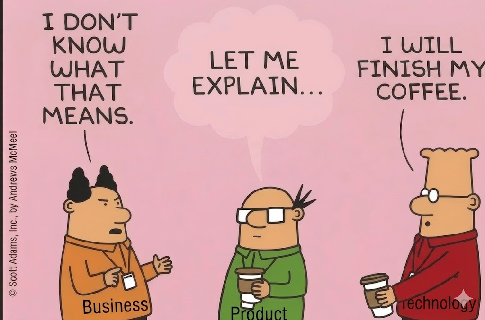

> The Business guy: "I don't know what that means."
>
> The Engineer: "Well, that explains a lot."
>
> The Product: standing there in silence.

> **Note:** Dilbert has IP rights.[^1]

That's not a joke about one confused employee. It's the default state of most AI hopefuls. Calling themselves: "rollouts".

## The nodding issue

Every vendor pitch, every all-hands, every roadmap slide is full of words everyone nods at: "agentic," "AI-native," "transformation." Nobody stops the meeting to ask what they actually mean for *this* business, *this* process, *this* P&L line.

So the nodding continues. Budgets get approved. Pilots get funded. And six months later, nobody can explain why the thing doesn't work — because nobody could explain, at the start, what "working" was supposed to look like.

That's not a model problem. It's a comprehension problem wearing a model's clothes.

## Another angle, same iceberg

This is the same iceberg [the ship manual](../bpt_business_ship_manual/) keeps coming back to, just lit from a different side: the gap isn't between "AI" and "no AI." It's between people who can say what a process actually does and people who are nodding along because the words sound right.

The [BPT](https://method.dbj.org/onboarding/section-03.html) OP model doesn't add more vocabulary to nod at. It forces the opposite — write down what the business actually does in plain terms; words a crew member who's never heard "agentic" could still follow.

If you can't say it in BPT, you don't understand it yet. You're just nodding.

## The takeaway

AI doesn't expose who has the best model. 

> **Note** AI exposes who actually knew what they meant. 

Get the second part right first. Deploy the [BPT Operational Model](https://method.dbj.org/bpt). With all the crew on the [CMM Level 5](https://method.dbj.org/cmm#levels).

Funny as it seems that is a true picture of three Dilbert&trade; characters enjoying the BPT OP model. While having the coffee.

___

[^1]: Scott Adams Inc. is the undeniable owner of Dilbert IP
