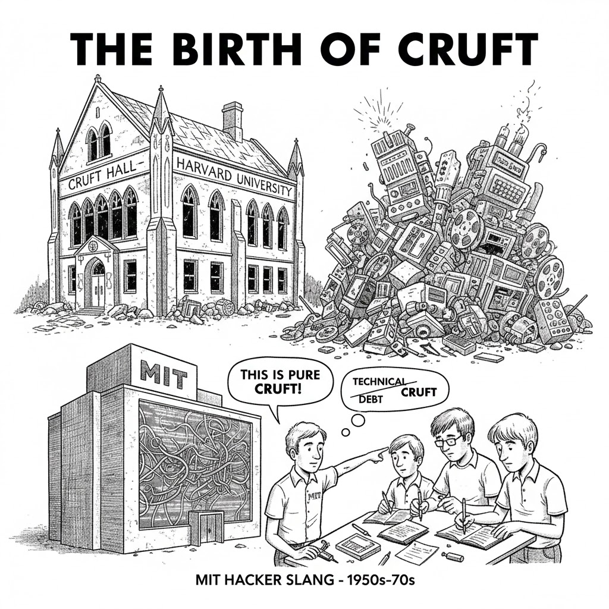

There's a word MIT hackers coined in the 1950s: **cruft** — useless, tangled, accumulated junk that makes a system incomprehensible and impossible to build on.

Sound familiar?

In 2026, we have a new variant: **crufty AI.**

Chatbots bolted onto data silos. LLMs fed dirty, unstructured, undocumented inputs. Automation layered on top of processes nobody fully understands anymore. **Pilots that never graduate**. Dashboards nobody uses. Vendors paid. ROI: zero.

This isn't an AI problem. It's a cruft problem.

You can't get intelligence out of a system that was never coherent to begin with. The model isn't the issue — the substrate is.

## Your AI isn't underperforming. Your architecture is.

### Before you buy another AI license, ask:

- Is your data governed, or just stored?
- Do your systems integrate, or just coexist?
- Does anyone have a current map of what actually runs this business?

AI amplifies what's already there. If what's already there is crufty, you'll get crufty results — faster and at greater expense.

The fix isn't a better model. It's architecture.
