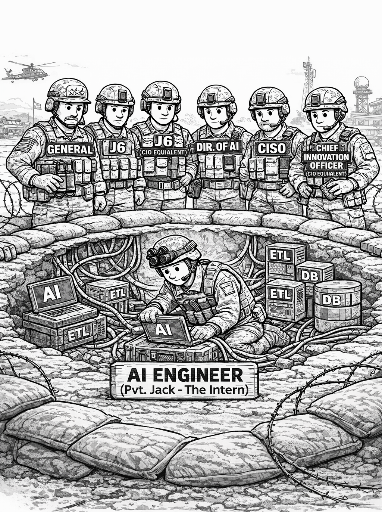

### Why ETL appears in the meme

The joke is unfortunately accurate. Before AI can do anything meaningful, someone must:

* Fix messy source systems
* Reconcile schemas
* Clean historical data
* Build reliable pipelines

That invisible plumbing work is **ETL**.

In both enterprise and military contexts, the "AI engineer in the trench" is usually fighting data silos, inconsistent schemas, legacy systems, and poor data quality.

> Implementing AI is rarely the hard part. Data engineering is.

---

# ETL vs ELT in Modern AI Architectures


## ETL (Extract → Transform → Load)

**Flow:** Source systems → Transform engine → Target warehouse. Transformation happens before storage.

**Strengths:** Clean, curated warehouse. Strong governance. Predictable outputs.

**Weaknesses:** Slow to adapt. High upfront modeling cost. Not friendly to unstructured data.

## ELT (Extract → Load → Transform)

**Flow:** Source systems → Data lake/warehouse → Transform inside warehouse. Raw data is loaded first.

**Strengths:** Flexible. Faster onboarding of new sources. Supports structured + semi-structured + unstructured. Better for ML experimentation.

**Weaknesses:** Can become a "data swamp." Governance must be engineered deliberately. Requires strong metadata discipline.

---

## Why AI Pushes Toward ELT

Modern AI systems need raw historical data, logs, event streams, text, images, signals, and iterative feature engineering. If you fully transform before storing, you lose raw signals, freeze business logic too early, and limit ML experimentation.

ELT keeps: **Bronze** (raw) → **Silver** (cleaned) → **Gold** (business-ready aggregates).

---

# The DBJ.METHOD Architecture Level

## 1. Conceptual Layer (Why)

At conceptual level, DBJ is not building pipelines. DBJ is enabling:

* Operational superiority
* Predictive decision support
* Automation of cognitive tasks
* Faster OODA loops (military framing)
* Product intelligence (enterprise framing)

Here, "AI" is a **business capability**, not a technology.

Core Conceptual Capabilities: Data as a Strategic Asset, Model-Driven Operations, Continuous Learning Systems, AI Governance & Risk Control.

---

## 2. Logical Layer (What)

### Data Domain Layer (Data Mesh principle)

Instead of central IT owning all data: each domain owns its data product, with clear data contracts, observable pipelines, and federated governance.

Logical Components: Domain Data Products, Data Contracts, Metadata Catalog, Feature Store, Model Registry, Experiment Tracking, CI/CD for ML.

### Data Processing Pattern

```
Sources → Raw (Bronze) → Cleaned (Silver) → Curated (Gold)
                                 ↓
                           Feature Engineering
                                 ↓
                               Model
                                 ↓
                          Deployment Endpoint
```

ELT feeds MLOps. This is the integration point.

---

## 3. Physical Layer (With What)

| Logical Component | Physical Realization |
| --- | --- |
| Raw Storage | ADLS Gen2 |
| Transform Engine | Spark / Synapse / Databricks |
| Feature Store | Databricks FS / Feast |
| Model Training | Azure ML |
| Model Registry | Azure ML Registry |
| CI/CD | Azure DevOps |
| Serving | AKS / Managed Endpoints |
| Monitoring | Application Insights + ML monitoring |

Raw first. Transform later. Train continuously.

---

## 4. Implementation Layer (How)

* Code repositories
* Deployment scripts (IaC: Terraform/Bicep)
* Data quality tests
* Pipeline observability

> **This is where most AI programs collapse.** AI maturity ≠ model quality. AI maturity = operational reliability of pipelines.

---

## 5. Where MLOps Fits

MLOps is operationalization of probabilistic systems under continuous data drift.

Core capabilities: Reproducible training, Dataset versioning, Feature lineage, Model registry, Deployment automation, Drift detection, Feedback loops.

Without ELT-style architecture, MLOps cannot function.

---

## 6. Where Data Mesh Fits

AI fails when data is owned by no one, poorly defined, or politically controlled. Data Mesh enforces domain responsibility, product thinking, and federated governance — mapping well to a mature TOGAF capability-based enterprise.

---

## 7. Mapping to TOGAF Capability Framing

**Business Capability:** Data-driven decision making

**Application Capability:** AI platform services, Model lifecycle services

**Data Capability:** Data product ownership, Metadata management, Data quality governance

**Technology Capability:** Elastic compute, Distributed storage, Secure ML serving

If ACMM was raised to L3 (as DBJ requires), we can define architecture standards, enforce governance, and establish reusable building blocks. AI delivery becomes feasible only at this maturity level.

---

## 8. The Brutal Reality

Most organizations: Announce AI strategy (Conceptual). Buy tools (Physical). Skip logical design. Ignore data ownership. Underinvest in implementation discipline.

Result: one AI engineer in the trench fighting broken schemas, undefined ownership, no metadata, no reproducibility.

---

## 9. What a Mature AI Enterprise Actually Looks Like

* Clear domain data products
* ELT lakehouse backbone
* Automated feature pipelines
* Full MLOps lifecycle
* Drift monitoring
* Governance integrated with EA

That is not "innovation." That is disciplined architecture.
