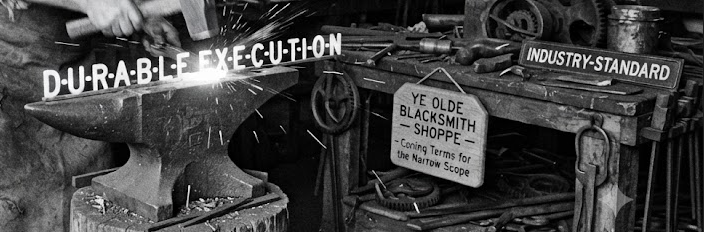


Durable execution is a crash insurance for a long-running software. It is not a business process, and adopting it does not mean your organization "has a workflow."


## What it actually solves

A program holds its state in memory, and memory does not survive the program. When a process dies halfway through a job, everything it knew is gone: which step it reached, which steps already completed, whether the payment went out once or twice. Regardless of the job.

For a job lasting milliseconds this is a non-issue; you retry it. For a job lasting three days and touching six external systems, it is a real liability — and that shape of job is now common, because applications are assembled from many small services and, increasingly, AI agents that run for a long time and cost tokens per step.

**Durable execution** is the category of software that records each step as it completes; a crash resumes from the last good point instead of starting over.

None of this is new. The industry called it a **long-running transaction** for decades and has been solving it since the 1980s — in mainframe transaction monitors, then in BPEL engines, now in code libraries. What is new is the name and the programming model, not the capability ([the lineage](#the-solution-is-old-the-name-is-new)).

That is the entire proposition. It is genuinely useful. It is also narrow.

## It borrowed a word

> And that is annoying.

The people who formalized and built this category came out of distributed systems, where "workflow" already meant "a long-running business job with steps." Reasonable in that room. Outside it, the word was long since occupied — by the business analyst's process diagram and by the organization's operational loop.

Comes 2025 and the same word named a governance rhythm, a stakeholder-alignment diagram, and a crash-recovery library. When an engineering team says "we've adopted a workflow," a board can hear that a process problem has been solved. But, nothing of the sort is actually true.

The industry has already fixed this, and the fix is the term **durable execution** itself: it names the guarantee, claims nothing about the business, and collides with nobody. Nothing better needs coining ([the reasoning](#on-coining-a-better-word)). What remains is a usage problem — "workflow" keeps getting reached for, out of decades long habit. Also in C-rooms where it means something else entirely.


**Be aware of the blast radius**

The question they should ask is not "do we have a workflow?" but "what breaks if this job dies halfway, and what does that cost us?" If the answer (they believe), is "nothing much," they do not need this. Plenty of well working systems do not have "durable execution".


## What are the costs

Two items are on the bill, and the second is the one that gets missed.

1. The direct cost is new requirement of another system to run: traditionally an orchestrator, a queue, workers, and a database, each with own failure modes and own operational burden. The newer approach collapses that into the database (already in place), which is a meaningful simplification.

2. The indirect cost is implementation architecture. Code written for a durable execution engine is shaped by that engine — steps have to be structured so they can be replayed safely. That is a coupling commitment. It is reversible, but not cheaply, and it is the sort of decision that should be made deliberately in Technology rather than inherited because someone was watching a conference talk.

## The summary

Durable execution is a good answer to a real (and narrow) question: *what happens to long-running critical work when the machine dies?*

If that question keeps you up at night, then buy the insurance. If it does not, the absence of a workflow engine is not a gap in your production system.

And either way, it has no bearing on whether operational loop works. 

---

## Appendix — the engineering detail

### The solution is old; the name is new

For most of the computing history this was called a **long-running transactions**. The literature is mature:

- **[Sagas](https://sigmodrecord.org/1987/12/09/sagas/)** (1987) — Garcia-Molina and Salem, SIGMOD. A long transaction is broken into steps, each with a compensating action to undo it, because holding database locks for hours is not viable. This is still the reference model for the problem.
- **TP monitors** — [CICS](https://www.ibm.com/products/cics-transaction-server), [Tuxedo](https://www.oracle.com/middleware/technologies/tuxedo.html) and relatives ran long-lived, recoverable business transactions in production for decades, with transaction logs and automatic restart. 
- **[WS-BPEL](https://docs.oasis-open.org/wsbpel/2.0/OS/wsbpel-v2.0-OS.html) / WS-Transaction** (early 2000s) — the same idea in the web-services era. Business Process Execution Language: an OASIS standard (2.0 ratified 2007) in which the process is declared as an XML document and handed to an engine to execute. The engine owns the state, the retries and the recovery — exactly the guarantee durable execution sells today.
- **Java EE, BPEL engines, Camunda** — the enterprise lineage the [taxonomy table](#the-two-axes) already lists under durable `macroflow` as we call it in this doc.

### None of that was called "durable execution"

The current name arrived through a separate product lineage from essentially one team:

- **AWS Simple Workflow Service** (2012) — Maxim Fateev led its public release
- **Azure Durable Task Framework** (2015-ish) — Samar Abbas, later became Azure Durable Functions
- **Uber Cadence** (2016) — Fateev and Abbas both led it
- **Temporal** (2019) — same two founders, forked Cadence, and coined "durable execution" for what they had been building since AWS SWF.

So the ad-hoc naming is recent, the capability is mature, seen and used. What genuinely changed is the programming model, not the guarantee: [sagas](https://sigmodrecord.org/1987/12/09/sagas/) and [BPEL](https://docs.oasis-open.org/wsbpel/2.0/OS/wsbpel-v2.0-OS.html) asked you to declare the process as data — an XML document or a diagram — and hand it to an engine. The modern tools let you write ordinary code in your own language and make the runtime responsible for replaying it deterministically after a crash. That is a real ergonomic improvement, and it is the whole of the novelty.

Worth keeping in view when a vendor presents this as a new category. It is a different interface to a problem the industry is solving since 1987.

### On coining a better word

The temptation is to fix the collision by inventing a term — `microflow` for the technical artifact, against `macroflow` for the business process. It is a fair but private label, and it introduces new vocabulary into a space already (bitterly) fighting over one word meaning several things.

What practitioners actually use circa 2026:

- **"durable execution"** — to distinguish from BPMN/BPEL "workflow"
- **"virtual resiliency"** — some literature, for the predecessor concept
- **"workflow-as-code"** — to contrast with visual/BPMN modeling

The conclusion this post already rests on: **"durable execution"** is the closest thing to an industry-standard term for this narrow scope, and it is worth adopting rather than coining past.

