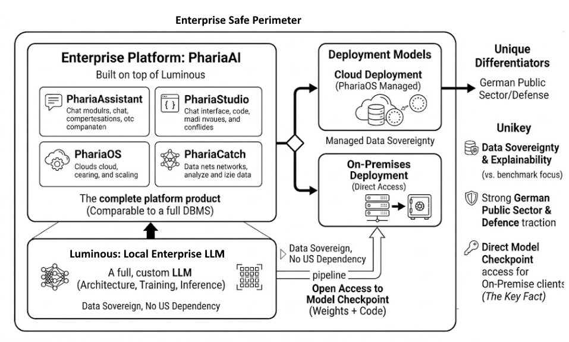

## Aleph Alpha: The Right Model

Aleph Alpha, founded in Heidelberg in 2019 by Jonas Andrulis, built **Luminous** — a full LLM. Not a wrapper, not a fine-tune of someone else's weights. Their own architecture, their own training, their own inference. They sit in the same category as OpenAI and Anthropic: model creators, not mills.

Their positioning was correct from the start: European sovereign AI. Data stays in Europe. No US cloud dependency. Strong traction with German public sector and defence. The differentiator is not raw benchmark performance — it is explainability and data sovereignty.

**PhariaAI** is the enterprise platform built on top of Luminous. Where Luminous is the engine, PhariaAI is the complete product: PhariaAssistant (chat interface), PhariaStudio (development environment), PhariaOS (deployment and scaling), PhariaCatch (knowledge capture). It is the full DBMS, not just the database engine.

For on-premises customers, Aleph Alpha grants open access to the full model checkpoint including weights and code. This is the key fact.

---

## The RDBMS Analogy

When you buy Oracle or DB2 you own the licence, you run it on your hardware, the vendor provides support, patches, and updates — but you are not dependent on the vendor's cloud for every query. Every transaction does not phone home.

Aleph Alpha's on-premises model follows the same pattern. Deploy once. Operate independently. Vendor relationship for support and updates only.

This normalises LLM infrastructure the same way RDBMS was normalised in the 1990s. The LLM becomes a **licensed infrastructure component**, not a cloud service you rent by the token.

Deutsche Bank, a German federal ministry, a defence agency — any of them can run Luminous weights on their own GPU hardware, run the full PhariaAI stack on their own infrastructure, and guarantee that zero data leaves their datacentre. The dependency that remains is identical to an enterprise software licence: support, updates, contractual relationship. No central mega-datacenter required.

---

## The Cost Structure Consequence

No hyperscaler margin is baked into every token. No egress fees. No per-query cloud billing that scales against you as usage grows. The cost model is CapEx: buy once, run indefinitely.

The LLM becomes a fixed infrastructure component. The economics are identical to:

- On-premises RDBMS licence
- On-premises messaging middleware (IBM MQ)
- On-premises ESB

For regulated industries this is not merely convenient — it is the only viable long-term model. Banking requires data to stay in the building. Defence requires air-gap capability. Healthcare satisfies GDPR trivially. Government guarantees jurisdiction.

The deeper insight is structural. Aleph Alpha scales **with their customers' existing GPU investment** rather than requiring Aleph Alpha to build and finance massive infrastructure themselves. The customer owns the hardware. Aleph Alpha provides the software. This is a lean business model and it is the correct architecture for the market they serve.

---

## The Industrial Ownership Pattern

The Schwarz Group — parent of Lidl and Kaufland, Europe's largest retail conglomerate — became the dominant investor in Aleph Alpha and runs PhariaAI natively on STACKIT, their German hyperscaler. Europe's largest retailer decided to **own the AI infrastructure** rather than depend on US hyperscalers for logistics, supply chain, and customer data processing.

This is not a tech company making a tech bet. It is an industrial company making an infrastructure decision. The same decision Deutsche Bank makes when it buys an RDBMS licence.

In April 2026, Cohere acquired Aleph Alpha in a deal valuing the combined entity at approximately $20 billion, with Schwarz Group committing $600 million as Series E lead investor in the merged company. The post-merger roadmap positions PhariaAI as the European orchestration and deployment layer of a transatlantic sovereign AI platform. The Cohere acquisition introduces procurement uncertainty for new customers and warrants monitoring before any contractual commitment.

---

## Conclusion

The pattern that emerges is not new. It is the same pattern that governed enterprise software adoption for thirty years.

The market does not move when the technology is ready. It moves when the procurement model is familiar. CIOs and CFOs understand CapEx plus support contract. They do not want infinite OpEx tied to someone else's datacenter at someone else's margin.

Distributed AI — meaning AI that runs on the customer's own hardware, under the customer's own governance, with the vendor relationship confined to software and support — is not a future aspiration. With Aleph Alpha's on-premises model it exists today.

The question for European enterprises is not whether this model is technically viable. It is.
The question is whether the Cohere merger preserves it.

---

*Dušan Jovanović — Enterprise Architect, DBJ.METHOD*

