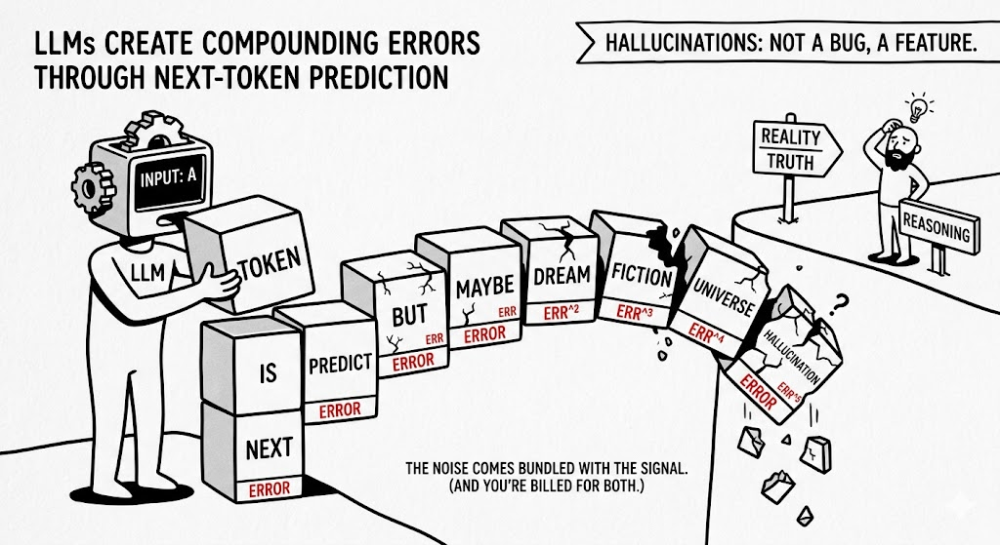

# Feature not a Bug

Nobody told you this when you readily signed up for the API key.

Every sequential LLM has the same training objective baked in: predict the next token. Not the next true thing. Not the next logical step. The next token — one symbol, conditioned on all the symbols before it. That’s it. That’s the whole game.


It produces text that reads beautifully. It reasons the way a drunk navigates by streetlights — confident, directional, and increasingly wrong.


Here is the mechanical problem. Each generated token feeds back into the context as input for the next prediction. So when the model makes a small error at step one, that error is now part of the premises at step two. The mistake doesn’t stay put. It becomes ground truth. The next token is predicted on top of a lie, and the one after that on top of a slightly larger lie, and so on down the chain until you’ve arrived somewhere that sounds perfectly coherent and has nothing to do with reality.

Even a tiny per-token error rate compounds exponentially over a long generation. The architecture makes it unavoidable.

This is why hallucinations are not a flaw to be patched. They are load-bearing. More data slows the drift. [RLHF](#fn-rlhf) roughens the edges. Neither changes what the model fundamentally is: a surface predictor that must generate [stochastic](#fn-stochastic) noise alongside anything useful it produces. The noise ships with the signal. You are billed for both.

---

**RLHF** — Reinforcement Learning from Human Feedback. A fine-tuning technique where human raters score model outputs; those scores train a reward model, which then guides further training via reinforcement learning. The goal is to steer outputs toward responses humans prefer. It does not change the underlying next-token architecture — it only reshapes which outputs the model favors.

**Stochastic** — randomly determined; having a probability distribution. In this context: the model does not pick the single most likely next token deterministically — it samples from a probability distribution, so identical inputs can produce different outputs. The randomness is by design; it is also why errors are baked in.