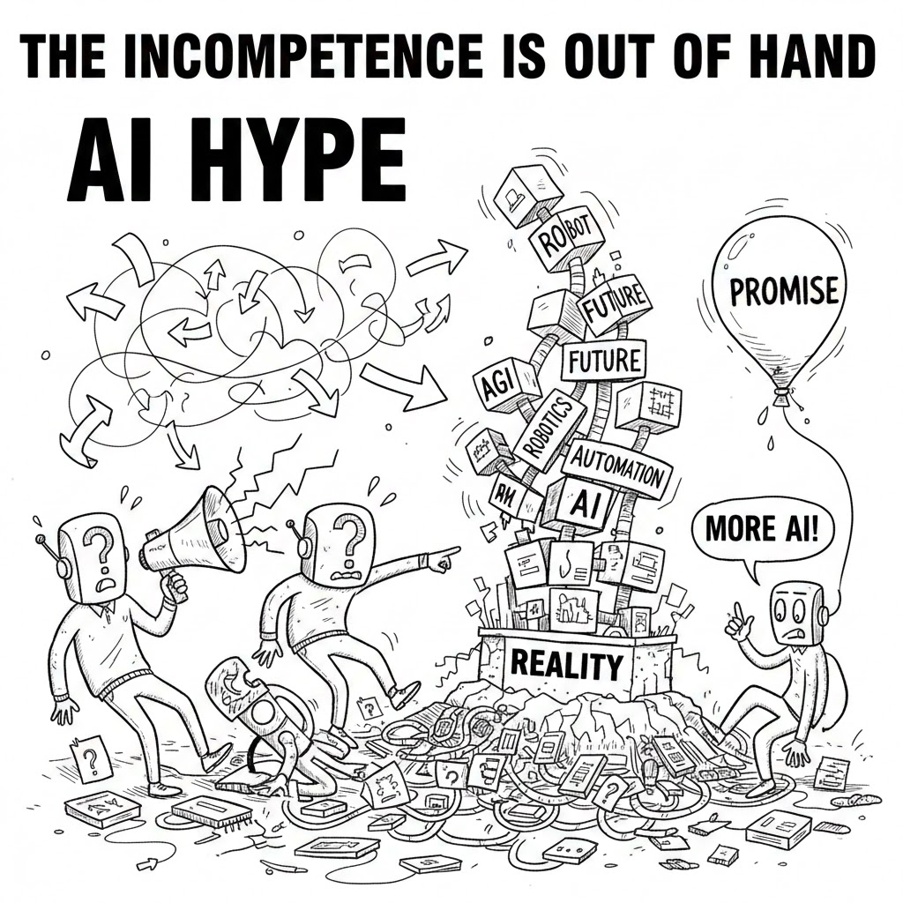

**The AI hype cycle is running on fumes — and the fumes are labeled "Future," "Promise," and "More AI!"**

We've all seen it. A wobbly tower of buzzwords. Robots with megaphones. Executives cheering at a pile of rubble with "REALITY" written at the base.

The cartoon writes itself because the pattern writes itself:

1. Announce the AI initiative
2. Stack acronyms until the tower looks impressive
3. Call any collapse a "learning opportunity"
4. Add more AI

What's actually out of hand isn't AI. It's the organizational incompetence that AI is being asked to hide.

Bad processes powered by AI are just faster bad processes. Unclear accountability with an AI layer is unclear accountability with a demo. A strategy that couldn't survive scrutiny before the LLM won't survive it after.

The robots in this picture aren't threatening us. They're pointing at us.

The question for every enterprise leader isn't *"Are we using AI?"* It's *"Do we actually know what problem we're solving, who owns it, and how we'll know if the 'solution' worked?"*

If the answer is vague, the tower will fall. Spectacularly. On camera.

Architecture exists precisely to prevent this — to make the structure visible before it collapses, not after.

---

*What's the most impressive-sounding AI initiative you've seen that turned out to be a very expensive megaphone?*
