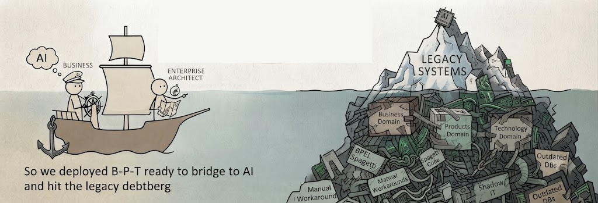

---
version:0.1
title: Types of Legacy
description: "In most organisations four types of legacy lean on each other. And make each other stronger."
date: 2026-10-10
tags: ["legacy", "technical", "debt"]
author: "Dusan B. Jovanovic"
cover:
  image: "debterg-1200x600.png"
---

Tech debt is not the only debt. There are four kinds, and they prop each other up.

1. **Process debt.** Workarounds and broken handovers that quietly became "how we do things."
2. **Data debt.** Nobody agrees on definitions. Nobody owns quality.
3. **People debt.** Skills investment deferred for years. Critical knowledge stuck in two or three heads.
4. **Technology debt.** The one everyone talks about: brittle integrations, dead platforms, every change harder than the last.

Bolt AI on top and none of this goes away. AI inherits all four debts and makes the fallout faster. A shiny new platform won't save you.

This is where ["Resilient ROI"](https://resilientroi.com/) do earn their money. Not by demanding poor engineers (who else?) clear every debt first . But by telling business leaders which debts they can live with (and for how long), which one kills the AI investment.And what will it actually costs to service the rest of company landscape.

---

No. Learning DBJ Method and setting up the BPT Loop does no help on its own.
