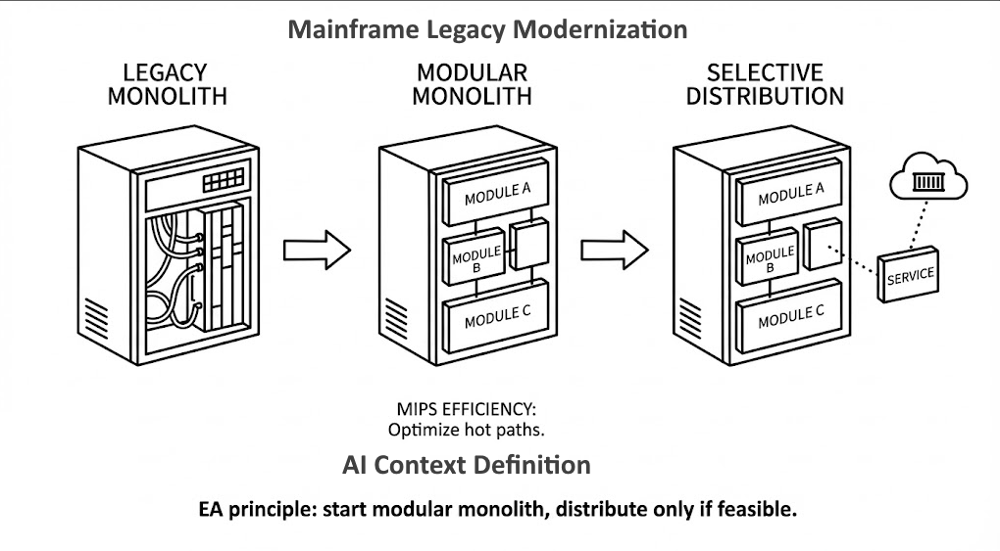

**Why they fit mainframes:**

1. **Natural migration path** — mainframe applications are already monolithic; modularizing in-place is less disruptive than immediate distribution
2. **Transaction boundaries** — mainframes excel at ACID transactions within single processes; modular monoliths preserve this strength
3. **Reduced network overhead** — avoids the latency and complexity of distributed calls that kill mainframe performance economics
4. **MIPS efficiency** — in-process module calls consume far fewer MIPS than network hops or message queues

### The Evolution Path

```
Legacy Monolith → Modular Monolith → Selective Distribution
```

- **Start:** Define bounded contexts within existing codebase
- **Refactor:** Extract modules with clear interfaces
- **Stabilize:** Prove the architecture, reduce technical debt
- **Optionally:** Extract specific modules to containers/services only where distribution adds value

### MIPS Impact

Modular monoliths let you optimize hot paths and reduce coupling *before* adding distributed system overhead — often achieving 30–60% MIPS reduction without leaving the mainframe.

> MIPS (Million Instructions Per Second) is the billing unit in mainframe environments. Reducing MIPS directly reduces operational costs — often millions annually for large enterprises.

This aligns with DBJ principle: start modular monolith, distribute only if feasible.
