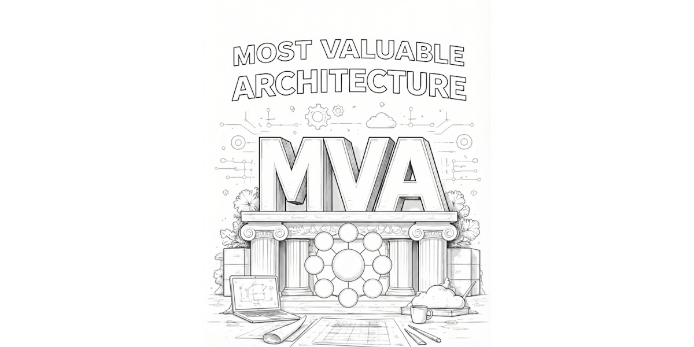

```
CMM --> MVA --> AI --> ROI
```

## AI won't fix a broken foundation.

Stop pouring budget into AI experiments that stall in the pilot phase. Technical debt is the silent killer of ROI. It's time to move past the "Minimum Viable" mindset and build your **Most Valuable Architecture (MVA)**. Clean the slate, structure your data, and finally see the returns you were promised.

## Turn Technical Debt into AI Equity.

High complexity shouldn't be the ceiling for your innovation. The MVA framework provides the structural integrity needed to bypass legacy bottlenecks. By applying a systematic, architectural approach to AI integration, we help you eliminate wasted spend and accelerate time-to-value.

---

**MVP** is a well-known "AGILE" movement idea. Release ASAP. Don't wait. Later cycles will ship the later versions. Time to market is more important than quality. That is why many call MVP: "Fake it until you make it."

**MVA** shifts the conversation from "doing the bare minimum to get by" to "investing in what actually scales."

---

If your AI initiatives aren't delivering, the problem isn't the model — it's the architecture. Stop building on sinking sand. Build a **Most Valuable Architecture** and turn your technical debt into a competitive engine.
