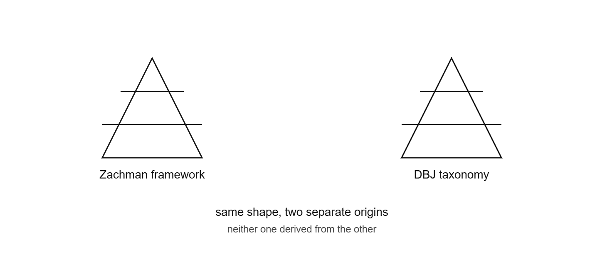
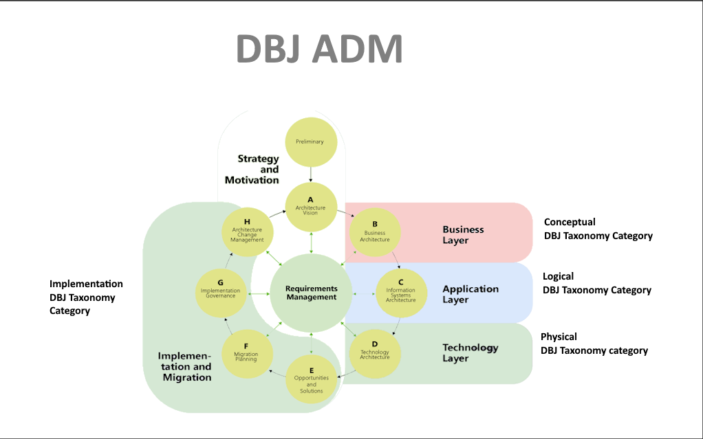

Someone described [DBJ Taxonomy](#taxonomy) this way: *"a taxonomy that maps to [Zachman](#zachman)-style layers (Strategic/Conceptual → Logical → Physical → Implementations)."*

Sounds credible. Sadly, it isn't true.

> That image is the simplified four-layer version quoted in the claim. It's not what Zachman actually defined — his framework is a 5×6 matrix (Scope/Business/System/Technology/Component crossed with What/How/Where/Who/When/Why), not a single top-to-bottom stack. The linear "Strategic → Logical → Physical → Implementations" progression is a loose paraphrase, which is also why the mapping claim doesn't hold up.

## What's actually described by the DBJ Taxonomy

[method.dbj.org/taxonomy_core.html](https://method.dbj.org/taxonomy_core.html) is organized around a small hierarchy with four top-level categories.

Nowhere does it cite Zachman. Nowhere does it claim to map onto Zachman's rows and columns (Scope / Business / System / Technology / Component × What / How / Where / Who / When / Why). There's no stated lineage at all.

## Why the Zachman claim might feel plausible

| | Zachman-style layering | DBJ Taxonomy |
|---|---|---|
| Shape | Abstract intent → concrete artifact | Abstract intent → concrete artifact |
| Origin | A named, formal framework | Industry wide convention |
| Claimed lineage | N/A | None stated |

Any taxonomy that goes from strategy down to implementation will *look* vaguely Zachman-shaped, because that progression is common sense, not a proprietary structure someone has to borrow. Resemblance in shape isn't evidence of structural similarity.

## Important closer near-miss: TOGAF

Zachman isn't the framework worth naming here — [TOGAF](#togaf) is. The DBJ taxonomy page's [encapsulates & references](#encapsulation-isnot-referencing) TOGAF, so there's an actual, citable connection in the repo.

> And that also happens to be true for the whole DBJ Method

That connection isn't accidental, and it isn't "DBJ Taxonomy maps to TOGAF" either. The DBJ Methodology principle is to [**encapsulate** TOGAF](#encapsulation-isnot-referencing) — keep its full apparatus (the [ADM](#adm) phases, artifacts, meta-model) underneath — and expose a simpler, logical "interface" on the surface of DBJ Methodology (and DBJ Taxonomy). TOGAF does the heavy lifting out of view; DBJ taxonomy is the small vocabulary you actually work with day to day.

Repeat: this is encapsulation illustrated, [not mapping](#encapsulation-isnot-referencing).

This is the vocabulary that is actually DBJ's own ADM derivative, with three DBJ Taxonomy categories — **Conceptual**, **Logical**, **Physical** — laid directly over the Business/Application/Technology layers, and a fourth, **Implementation**, wrapping the Strategy and Migration phases. That's a real, citable, diagrammed relationship — the taxonomy names sit on top of specific (DBJ) ADM phases, on purpose, as the vocabulary and interface to them.

It's a different claim from "derived from" or "maps to Zachman." It's DBJ's own layer, [encapsulating](#encapsulation-isnot-referencing) TOGAF's ADM, not a repaint of Zachman's rows and columns.

## The actual lesson

It's tempting — for credibility, or just to sound rigorous — to describe DBJ's own taxonomy as "mapping to" a well-known framework. Don't, unless you can point at the sentence where that mapping is asserted.

<!-- If a claim about lineage can't be traced to a source, the right answer is "I don't know if that's true," not a nod along. That's true of Zachman here, and it's true of any borrowed authority a framework leans on. -->

---

## Vocabulary

(aka: "terms used above")

**DBJ Taxonomy** — the category structure defined at [method.dbj.org/taxonomy_core.html](https://method.dbj.org/taxonomy_core.html), organizing DBJ Method artifacts under top-level categories and capabilities.

**Zachman Framework** — an enterprise architecture classification scheme organizing artifacts across five perspectives (Scope, Business, System, Technology, Component) and six interrogatives (What, How, Where, Who, When, Why). Origin: John Zachman, 1987.

**TOGAF** — The Open Group Architecture Framework, a detailed enterprise architecture methodology and set of tools, including the Architecture Development Method (ADM). DBJ Methodology encapsulates TOGAF underneath and exposes a simpler interface via DBJ Taxonomy.

**ADM** — Architecture Development Method, TOGAF's core iterative cycle of phases (Preliminary, Vision, Business, Information Systems, Technology, Opportunities, Migration, Governance, Change Management). DBJ's ADM derivative maps DBJ Taxonomy categories directly onto these phases.

**Encapsulation is not Referencing** — DBJ encapsulation hides TOGAF's full apparatus behind DBJ's own DBJ Method surface. Callers only ever see DBJ (Taxonomy) names, never ADM (TOGAF) phases directly. Referencing would instead cite TOGAF terms alongside or in place of DBJ's own, which is exactly the loose "maps to Zachman" move this post is arguing against.
