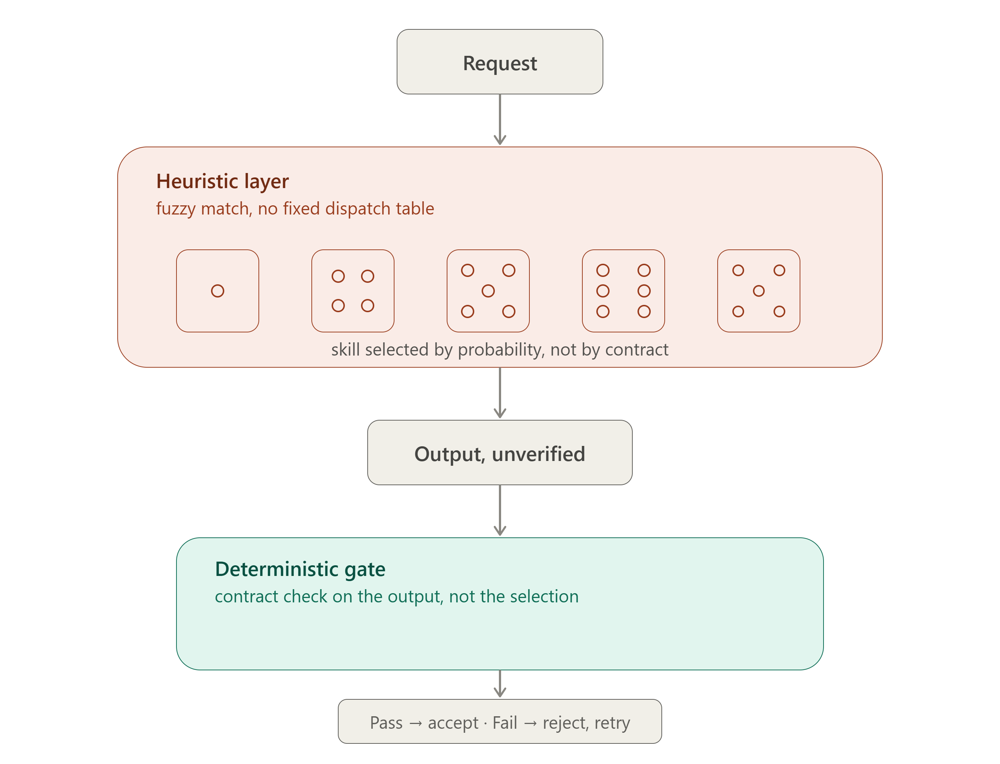


Summary: skill.md is not guaranteed to be used


## DBJ Observations and Comments

1. **Observation**: runtime infrastructure **is not** deployment infrastructure
   1. Agreed, so what? 
      1. In the era of the general lack of experienced engineers that has to be said. Plainly.
2. **Observation**: Skill is key problem is, it is keeping the whole agent scaffolding non-deterministic
   1. It's not Skill, it's the mechanism that is supposed to use the Skill. 
      1. Fuzzy natural-language matching against a description, decided by the model at invocation time rather than part of a fixed dispatch. 
    2. same mechanism is what makes deferred-tool loading (ToolSearch), subagent selection. 
       1. Also the ordinary tool choice (Grep vs Read vs Agent) is then non-deterministic too. 
    3. Skills are just the most visible facet of the LLM non-determinism because they're named and listed explicitly. 
       1. But skills are used non deterministically.
   2. The classical-software analogue is late binding / reflection-based plugin dispatch
   3. Skill mechanism is trading a fixed call graph for runtime flexibility, and paying for it in determinism lacking. 
   4. Repeating. It is not "Skill" that is the problem, it is that harness resolves most capability binding (skills, tools, subagents, memory recall) via probabilistic matching instead of a deterministic dispatch table
      1. And that's a structural feature of the whole LLM architecture, not a flaw isolated to the Skills.
   5. There is no deterministic table dispatch. It is as simple as that


The Message

Skills-as-currently-specified are not a component LLM users can put a hard SLA on. They're a heuristic layer, not infrastructure. Any system using them needs a deterministic fallback/verification layer above the fuzzy dispatch.That is the core.


## Consequence

Treat Skills/Tools/subagent selection as an untrusted heuristic router — **never as the control plane**. 

Put a deterministic layer that verifies *after* the fact (did the right capability actually fire, did the output satisfy the contract).

LLM roll the dice on **which** skill; a deterministic gate decides if the output survives.
