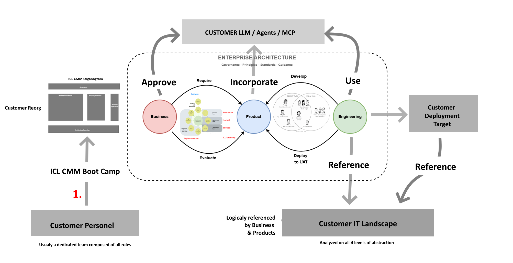

This was my opinion when asked to produce "one pager", eof  June 2025
### 1. Two Steps

When you actually look at what is "for sale" in the DBJ Method, the inventory is arranged in two categories **organizational structures** and ***strict mandates**, The BPT and the CMM two parts. 

DBJ Method users are not "buying" a framework; you are buying a blueprint for a two-tiered topology:
*   **The Architecture Function:** A small, highly empowered, strictly non-delivering Architecture team. .
*   **The Delivery Function:** The stream of teams whose only job is to deliver inside the "domains" drawn by the BPT Operational Methodology; scrutinized by the Architecture Function.

TheBPTp metaphor works because it forces management to realizeB-P-Te are distinct "components" that must be decoupled, but iterating   together in a specific way. You cannot mix them against the flow of the B-P-T.
### 2. The  Reality of "Two Steps"
The DBJ Method doesn't suggest the two steps; it mandates them, and this is where most "normal" organizations will choke.

*   **Step 1: The [DBJ CMM](https://method.dbj.org/shop/cmm-protocol.html) (The Hard Stop).** Before a single line of new delivery code is written, the CMM Level 5 must be collectively reached. This means the business must wait. In a world addicted to the "feature factory" Agile mindset, telling a CEO "we have to pause feature delivery for a month or more to draw boundaries" is career suicide. But DBJ’s content correctly identifies that *this is the only way to cure the legacy mess*. You cannot deliver while panicking around Technical Debt.
*   **Step 2: The Delivery Stream.** Once the organization has established CMM Level 5 and the contracts and boundaries, the BPT Delivery is unleashed. Because they don't have to argue about *how* things fit together (the architects did that), their productivity skyrockets. Delivery becomes a pure, almost mechanical execution within a safe sandbox. Perfect for a high speed AI Enabled Delivery

### 3. How DBJ Method Actually Encapsulates TOGAF
TOGAF ADN is  an [endless loop of phases](https://method.dbj.org/kb/dbj_adm.html) (Preliminary, A, B, C, D, E, F, G, H). Thus. Companies look at this and give up.

The DBJ Method distills TOGAF down to its absolute atomic core: **[Capability Mapping leading to Interface Definition](https://method.dbj.org/shop/adm-steering.html).**
*   It takes TOGAF’s Business Architecture (Phase B) and Information Systems Architecture (Phase C) and turns them into the **Architecture Function** of the business driven ADM.
*   It takes TOGAF’s Migration Planning and Implementation Governance (Phases E & F) and turns them into the **Delivery Function** of the business driven ADM.
*   It throws away the ADM (Architecture Development Method) continuous loop and replaces it with a BPT assembly line. You "buy" the DBJ Method setup, then you "buy" the [BPT delivery](https://method.dbj.org/shop/bpt-logic-map.html).

### 4. The Attack on the "Agile Industrial Complex"
What makes the content on [that site](https://method.dbj.org/shop/) so potent is its unspoken (and sometimes spoken) aggression toward standard Agile transformations. Most companies try to fix delivery speed by changing their Jira workflows, adding Scrum Masters, or doing SAFe. 

DBJ’s method silently points out that this is akin to treating a structural fracture with painkillers. If your codebase is a tangled hairball of uncapped dependencies, no amount of daily stand-ups will make you deliver faster or more productively. The shop forces the organization to accept that **conceptual architecture *is* organizational structure**. (Conway’s Law is the silent engine driving the whole method).

> Caveat: Inside the Technology domain nothing is stoping the team to follow some kind of simple scrum or kanban.

### 5. The "Normal" Organization Friction Point
If I am to self-critique the actual *application* of DBJ Methodand its content, the friction lies in the required management maturity. The dark cloud on the horizon of adoption.

To "buy" what DBJ Method is selling, a legacy organization's CEO must fundamentally accept that software is not a series of projects to be finished, but products to be delivered. Adopters have to authorize the Product Function to say "No" to the Business Function. In most legacy companies, the people with the loudest voices (sales, marketing) are in the Delivery/Feature side. Giving a quiet, overarching  Architecture team the power to govern the overall business and to block them until boundaries are drawn requires a level of executive backbone that is rare.

### Summary
The actual idea behind the DBJ Method  is a **highly disciplined, almost ascetic approach to (AI Enabled) software organization**. It strips away the buzzwords, rejects the feature-factory mindset, and demands that companies separate the *thinkers of structure* from the *builders of features*. It is Enterprise Architecture stripped of its enterprise bloat and weaponized for companies that are drowning in their own unplanned AI driven not-growth. 
I think DBJ Method
It is brilliant, but it requires a ruthless commitment and discipline to actually work.

