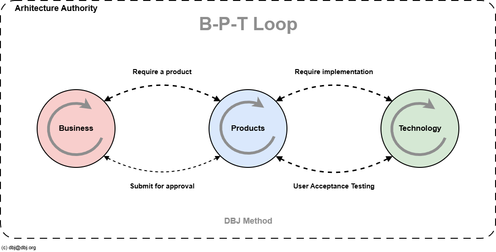
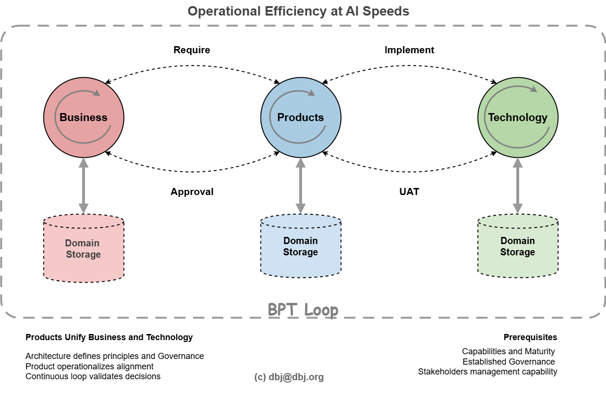

I was asked to produce a DBJ Method "one-pager" at the end of June 2026. This is my opinion, revised on 2026-09-28.

> **AI Speed makes it faster. The DBJ Method makes it possible.**

The DBJ Method gives an organisation [operational efficiency in the presence of AI](https://method.dbj.org/adoption/operational_efficiency.html). The onboarding is matured: first the organisation becomes efficient without AI, then it becomes efficient through automation and AI. AI accelerates an organisation that already runs well. It does not repair one that does not.

### 1. What is in the shop window

Two things: the **DBJ CMM** and the **BPT**. The first is a mandate on people, the second an organisational structure.

Adopters are not buying a framework. They are buying a blueprint of how the company operates:

*   **The Architecture authority.** Small, empowered, and never delivering. It defines principles, governs transitions and measures alignment. It navigates; the Business steers.
*   **The domain teams.** There is no single team. Each of the three domains, Business, Products and Technology, holds one or many teams, so an adopter has at least three.

### 2. Two steps, mandated

AI is an very fast business arena. Players have to be well trained, before they enter. The DBJ Method does not suggest these two steps; it mandates them. This is where most organisations will choke.

*   **Step 1: [DBJ CMM L5](https://method.dbj.org/cmm/dbj_cmm.html#levels). The hard stop.** Nothing happens inside BPT before L5 pass card: no delivery, no ADM wheel, no AI. There is no lower gate. What is measured is the maturity of the people involved: a team's maturity is the sum of its people's, and Organisation Maturity is the sum of its domain teams'. The business should wait, not push the teams too soon into the arena. In a world addicted to the "feature factory", telling a CEO "we pause feature delivery until our people are mature enough" is career suicide. But it is the only way to cure the legacy mess. You cannot deliver while panicking around technical debt.
*   **Step 2: The BPT Loop.** Once the people are holding the L5 pass card, the [B ↔ P ↔ T loop](https://method.dbj.org/bpt/bpt_operating_model.html) is unleashed in the organization. Nobody argues about *how* things fit together; that is already decided and written down. Delivery becomes almost mechanical execution inside a safe loop. Perfect for high-speed, AI-enabled delivery of Products.

### 3. B-P-T: one loop

Business-Products-Technology is the central theme of the DBJ Method. It is the operating model: three decoupled domains acting together in an endless loop, aimed at a fast, safe and feasible stream of delivered products. The Business declares the product, Products defines it, Technology implements it.

The metaphor works because it gently forces management to see their responsibility; the B of the B, P and T as three distinct components. They are decoupled, but iterate together in one specific way.

**There is always only one BPT.** Growth is vertical: more initiatives, products and projects inside the domains, never more loops. Loop stays resilient and simple. A large organisation may set up its BPT, first for one product only; the people working on it are the BPT Teams, and it is their maturity that is measured, not the legacy organisation around them.

### 4. DBJ Method encapsulates TOGAF

The TOGAF ADM (Architecture Development Method) is an endless loop of nine phases (Preliminary, A to H). Companies look at it and give up.

The [DBJ ADM](https://method.dbj.org/adm/dbj_adm.html) cuts it to five steps: Strategy & Motivation, Business, Application, Technology, Implementation & Migration. Each step produces one written deliverable, and Requirements Management sits at the hub.

*   The Business is at the helm of the wheel. Enterprise Architecture is "just" the navigator.
*   The wheel authorises delivery. It never delivers. The BPT loop delivers.
*   The wheel turns only at DBJ CMM L5. Below that, there is nothing to steer.

TOGAF gives structural integrity but stays underneath. Organization roles never see its complexity directly.

### 5. The attack on the "Scrum Industrial Complex"

What makes [the method](https://method.dbj.org/) potent is its unspoken (and sometimes spoken) aggression towards standard Scrum transformations. Most companies try to fix delivery speed by changing Jira workflows, adding Scrum Masters or doing SAFe.

The DBJ Method quietly points out that this is treating a structural fracture with painkillers. If your codebase is a tangled hairball of uncapped dependencies, no amount of daily stand-ups will make you deliver faster. The method forces the organisation to accept that **conceptual architecture *is* organisational structure**. Conway's Law is the silent engine, behind the whole method.

> Caveat: inside the Technology domain nothing stops a team from following some agile delivery. But today that means almost all are agents. See the [Agentic Agile Manifesto](https://iceberg.dbj.org/posts/dbj_agentic_agile_manifesto/).

### 6. The friction point

If I am to self-critique the *application* of the DBJ Method, the friction lies in the required management maturity. That is also the dark cloud on the horizon of AI adoption.

To "buy" what the DBJ Method is selling, a legacy organisation's the board room, must accept that software is not a series of projects to be finished, but products to be delivered. The board must also accept that the organisation is measured by what its people are now able to deliver, not by what they delivered last quarter. Also, adopters have to authorise the Architecture authority to say "No" until the boundaries are drawn. In most legacy companies the loudest voices (sales, marketing) sit on the opposing feature side. Giving a quiet, overarching architecture function the power to block them takes executive backbone that is rare.

### Summary

The idea behind the DBJ Method is a **highly disciplined, almost ascetic approach to the (AI-enabled) organisation**. It strips away the buzzwords, rejects the feature-factory mindset, and demands mature people before any delivery and before any AI. It is Enterprise Architecture stripped of its enterprise bloat, and weaponised for companies drowning in their own unplanned, AI-driven not-growth.

I know the DBJ Method is brilliant. But it requires ruthless commitment and discipline to actually work.

Each domain keeps its own storage, and the loop runs only on its prerequisites.
