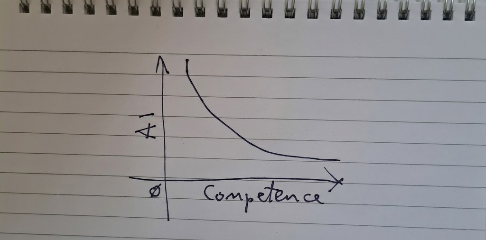

There's a ladder. The rungs are labeled "AI Competence." A novice climbs it, rung by rung, using a critical shortcut: *"I didn't learn, but the AI did."*

It works. For a while it works great. The climb is fast, the view improves with every step, and the effort-to-altitude ratio feels like magic.

Then the ladder ends. Not because the climber ran out of energy — because the ladder did. That point is the Danger-Kruger Peak: the spot where AI hallucinations start looking exactly like wisdom, because the climber has no competence of their own left to tell the difference.

## The shape of the curve

Plot it and the curve is brutal. On one axis, competence. On the other, how much an AI can lift you above your own level.

At zero competence, the lift is enormous — practically vertical. A complete novice handed a capable model looks, briefly, like an expert. But the curve bends hard and fast. The more competence you actually have, the less *extra* altitude the AI gives you, because you're already closer to the ceiling it can reach.

The novice doesn't see the bend. From the bottom of the ladder, it looks like the climb just keeps going.

## "Thanks, I'll take it from here"

At the peak, the power user in the cartoon says it plainly: *"Thanks, AI, for the spellcheck. I'll take it from here."*

That's the line that separates the two outcomes of this curve.

- **The power user treats the AI's output as a draft.** They have enough competence to spot the seams — the hallucinated citation, the subtly wrong assumption, the code that compiles but doesn't do what it claims. The AI did the typing; the human still owns the judgment.
- **The novice treats the AI's output as the destination.** There's no internal signal left to say "this is wrong," because the shortcut that got them up the ladder was *not building that signal in the first place*.

Both climbers reach the same peak. Only one of them knows it's a peak.

## Why this matters for organizations adopting AI

This isn't a worry about individual users being fooled by a chatbot. It's a structural risk for any team that lets AI substitute for the formation of judgment, not just the execution of tasks.

- **AI competence and domain competence are different axes.** Being fast and fluent with a model is not the same as being able to evaluate what it produces. An org can be highly "AI-competent" and dangerously thin on the judgment needed to catch its failures.
- **The shortcut is invisible until it's load-bearing.** Skipping the learning curve costs nothing when the AI is right. The bill comes due exactly when it's wrong — and by then, nobody on the team has the competence to notice.
- **Seniority is the hedge, not the model version.** Upgrading the AI doesn't move the peak. What moves it is having people in the loop who climbed the competence ladder the slow way, and can say "I'll take it from here."

The fix isn't to climb slower. It's to make sure someone on the team has already finished the climb — so when the ladder ends, someone notices.

