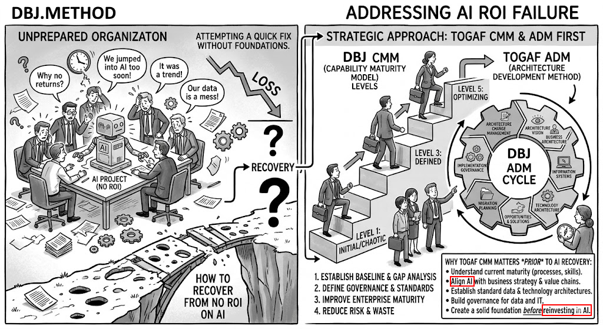

**Question:** Why does DBJ begin with Capability Maturity Model assessment rather than jumping straight into technical delivery?

**Answer:** Because transformation fails without measurable organizational readiness.

## The Foundation Problem

Most enterprises attempt AI-assisted modernization while operating at ad-hoc levels. This creates:

- Misaligned expectations between business and technology
- Inconsistent terminology across stakeholder groups
- Undefined accountability for architectural decisions
- No repeatable process for evaluating technical risk

> Architecture-led, AI-assisted delivery requires stable foundations. CMM onboarding establishes those foundations before any work begins.

## The DBJ Method

The DBJ.METHOD method operates as a bridge with two arches: **Onboarding** and **The BPT Loop**.

CMM assessment forms the first arch — preparing organizations for sustainable EA-led transformation.

## Arch 1: Onboarding

DBJ establishes capability maturity foundations using a two-phase approach.

### Phase A: Assessing Current State

DBJ Enterprise Architects evaluate organizational maturity using ACMM Levels L0–L5. This phase evaluates five structural elements present in every organization:

- **Governance** — decision-making authority, policies, oversight
- **Skilled Resource Pool** — people and available competencies
- **Projects / Portfolios** — work initiation, execution, delivery
- **Business Operations** — day-to-day function and continuity
- **Architecture Repository** — organizational knowledge base

The organization's DBJ CMM level is the minimum score across all five elements — a high score in one area cannot mask a critical gap in another.

Assessment activities:
- Establishes shared vocabulary through Common Taxonomy
- Identifies capability gaps via ACMM scorecard across all five elements
- Defines achievable initial target state (L3 — Defined)

**Outcome:** ACMM baseline assessment with EA-guided improvement roadmap

### Phase B: Achieving Defined Maturity (L3)

DBJ Enterprise Architects guide, document and implement architecture processes, transitioning organizations from ad-hoc (L1) to defined (L3) operations.

- Implements governance structures with executive engagement
- Deploys architecture-driven communication practices
- Embeds Common Taxonomy as organizational standard

**Outcome:** Organization operating at CMM L3 across all five elements — the entry threshold for the DBJ BPT methodology

## Why This Matters

Without ACMM foundations:
- Architectural decisions lack organizational support
- Technical debt reduction efforts fail to gain traction
- Business-technology alignment remains superficial
- Transformation initiatives stall in governance gaps

ACMM onboarding ensures organizations can sustain the improvements DBJ delivers.
